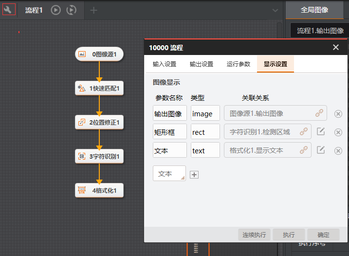
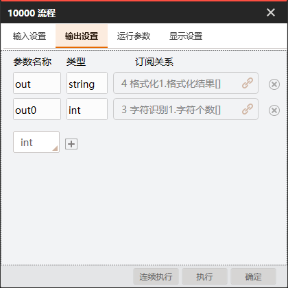
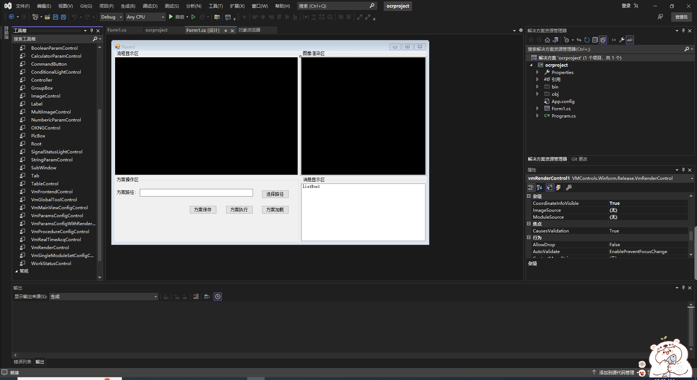
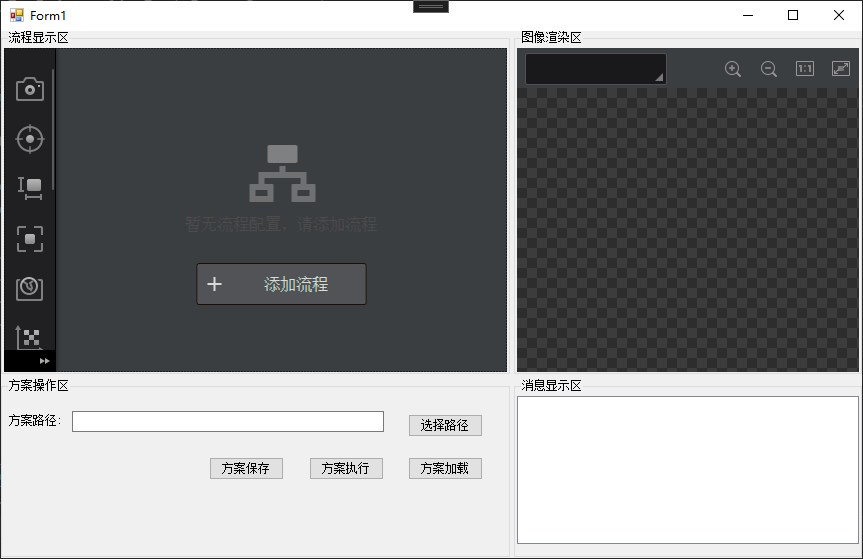
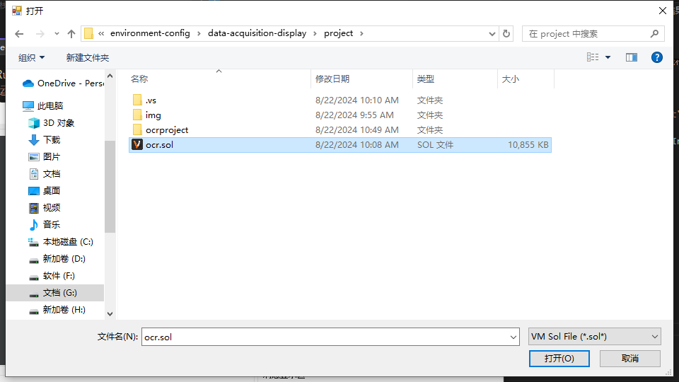
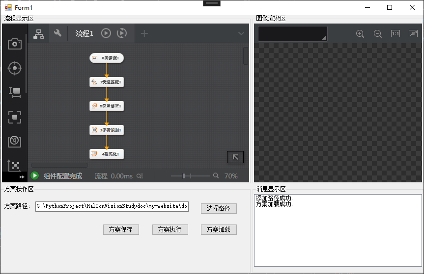
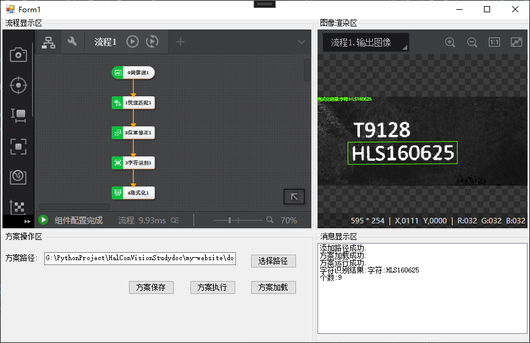
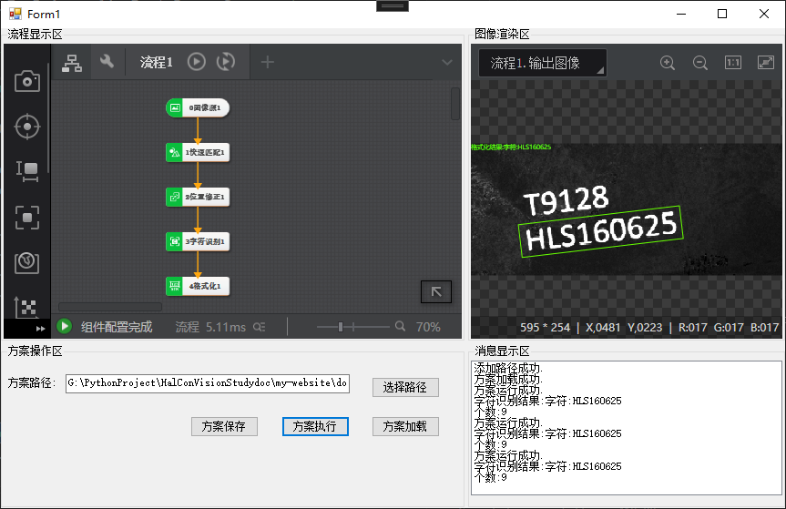
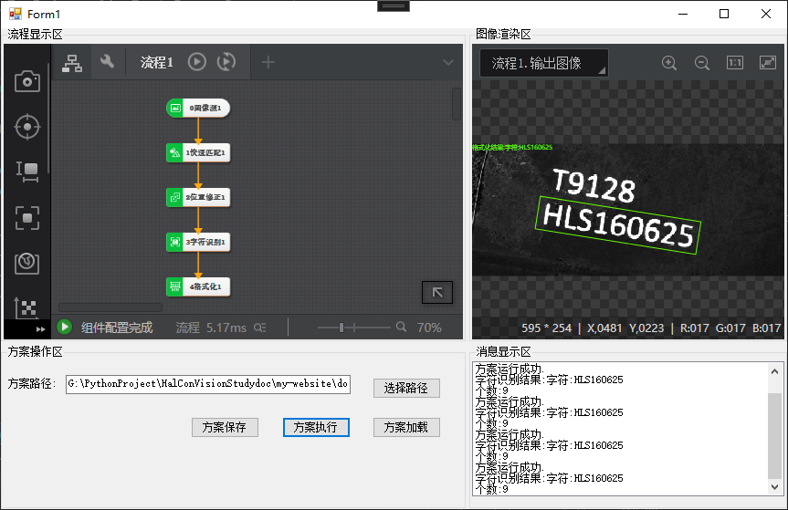

# 渲染及数据结果获取

流程的结果分为渲染和数据的结果,在进行结果获取之前需要在VM中先对流程进行配置

import VideoPlayer from '@site/videoPlayer.js'

<VideoPlayer src="https://xian-vforum.oss-cn-hangzhou.aliyuncs.com/2022-07-04_nurXi9HwaO_1.3%E6%B8%B2%E6%9F%93%E5%8F%8A%E6%95%B0%E6%8D%AE%E7%BB%93%E6%9E%9C%E8%8E%B7%E5%8F%96_x264.mp4"/>

## 流程配置

如果要获取流程1的结果,点击流程左边的设置按钮,在显示设置中配置渲染结果,在多选框中配置所需显示的类型.参数名称可以自行设置,关联关系绑定对应类型的模块

### 1. 显示设置



### 2. 输出设置

输出格式化结果和字符个数



确认保存

### 3. 关闭VM,打开vs二次开发

1. 添加VmRenderControl控件



2. 编辑方案执行事件

```Csharp
        private void button3_Click(object sender, EventArgs e)
        {
            VmSolution.Instance.SyncRun();
            listBox1.Items.Add("方案运行成功.");
            listBox1.TopIndex = listBox1.Items.Count - 1;

            //获取结果,分为渲染结果和数据结果

            VmProcedure vmProcedure = (VmProcedure)VmSolution.Instance["流程1"];

            vmRenderControl1.ModuleSource = vmProcedure;

            string ocrResult = vmProcedure.ModuResult.GetOutputString("out").astStringVal[0].strValue;
            string ocrNum = vmProcedure.ModuResult.GetOutputInt("out0").pIntVal[0].ToString();

            listBox1.Items.Add("字符识别结果:"+ocrResult);
            listBox1.TopIndex = listBox1.Items.Count - 1;
            listBox1.Items.Add("个数:" + ocrNum);
            listBox1.TopIndex = listBox1.Items.Count - 1;

        }
```

### 4. 运行程序



1. 选择路径



2. 加载方案



3. 方案执行







可以看到,结果已被正常渲染,获取到的字符信息和字符个数也在消息显示区正常显示.


