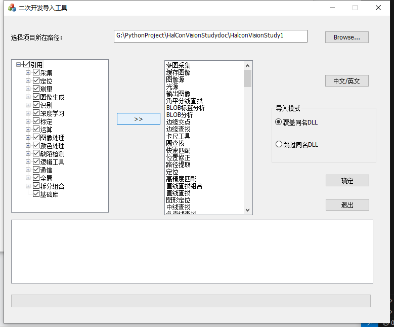
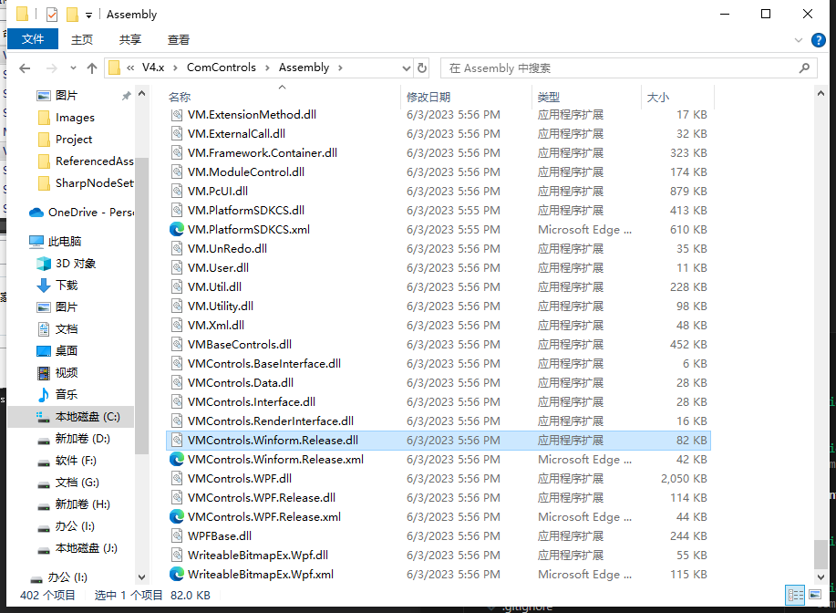
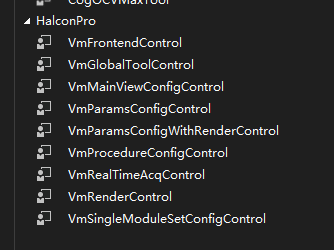

# 环境配置

import VideoPlayer from '@site/videoPlayer.js'

<VideoPlayer src="https://xian-vforum.oss-cn-hangzhou.aliyuncs.com/2022-07-04_mS51vSSm23_1.1%E7%8E%AF%E5%A2%83%E9%85%8D%E7%BD%AE_x264.mp4"/>

## 1. 创建项目

1. 打开Visual Studio,新建.NetFramework项目,选择WindowsForms,点击下一步,选择项目名称,点击下一步,点击确定
2. 打开项目属性,点击生成选项,去掉首选32位勾选.

## 2. 添加程序引用

1. 没有安装VisionMaster的可以到海康官网下载安装.
[https://www.hikrobotics.com/cn/machinevision/service/download/?module=0](https://www.hikrobotics.com/cn/machinevision/service/download/?module=0)

我这里选择VisionMaster基础安装包V4.3.0,下载完成后按指导下一步安装即可.

2. 打开VisionMaster安装路径,C:\Program Files\VisionMaster4.3.0\Development\V4.x\ComControls,打开Tool文件夹,运行ImportRef.exe

3. 导入dll类库,这里选择所有引用,文件路径选择我们刚才在Visual Studio中新建的路径,导入模式选覆盖同名dll，点击确定.

4. 导入成功后,回到Visual Studio,点击全部重新加载.

打开引用,对应类库已添加.

## 3. 添加控件
1. 打开工具箱,右键添加选项卡,自定义名字,HalconPro,右键选择选择项,浏览C:\Program Files\VisionMaster4.3.0\Development\V4.x\ComControls\Assembly,选择VMControls.Winform.Release.dll

2. 点击确定,工具栏对应选项卡可以看到刚才导入的dll工具控件,也可以搜索VM,找到对应的控件,可以拖动到主窗体上使用.

以上就是使用VisionMaster前环境配置的基本步骤.

