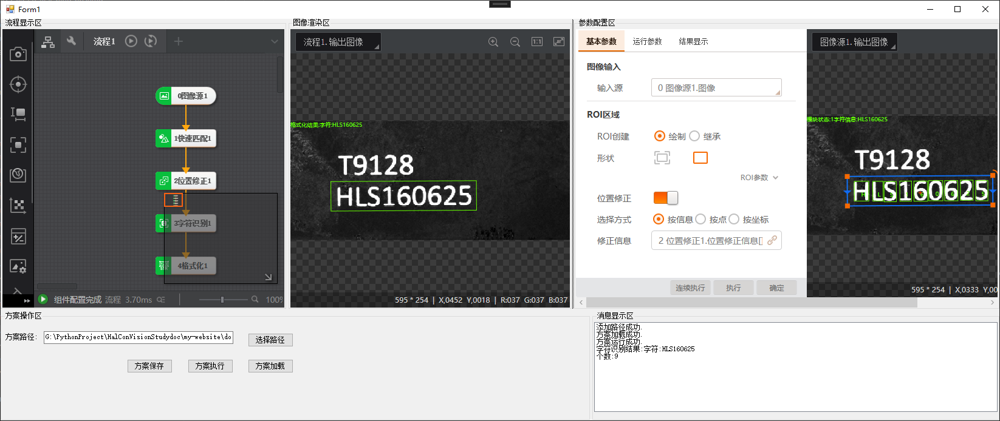
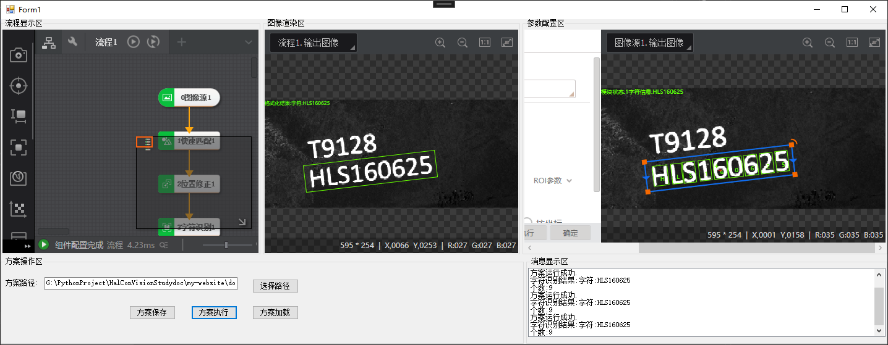

# 参数模块配置

import VideoPlayer from '@site/videoPlayer.js'

<VideoPlayer src="https://xian-vforum.oss-cn-hangzhou.aliyuncs.com/2022-07-04_f9KiRjrJqD_1.4%E6%A8%A1%E5%9D%97%E5%8F%82%E6%95%B0%E9%85%8D%E7%BD%AE_x264.mp4"/>

## 参数配置控件

工具箱中提供了两个参数配置控件.
- VmParamsConfigControl是不带渲染的参数配置控件.
- VmParamsConfigWithRenderControl是带渲染的参数配置控件.

### 1. VmParamsConfigWithRenderControl


1. 配置模块数据源

```Csharp
        private void button3_Click(object sender, EventArgs e)
        {
            //模块的参数配置
           
            IMVSOcrModuCs.IMVSOcrModuTool ocrTool = (IMVSOcrModuCs.IMVSOcrModuTool)VmSolution.Instance["流程1.字符识别1"];
            VmParamsConfigWithRenderControl vmParamsConfigWithRenderControl1 = new VmParamsConfigWithRenderControl();
            vmParamsConfigWithRenderControl1.Dock = DockStyle.Fill;
            vmParamsConfigWithRenderControl1.ModuleSource = ocrTool;
            groupBox5.Controls.Add(vmParamsConfigWithRenderControl1);

            VmSolution.Instance.SyncRun();
            listBox1.Items.Add("方案运行成功.");
            listBox1.TopIndex = listBox1.Items.Count - 1;

            //获取结果,分为渲染结果和数据结果

            VmProcedure vmProcedure = (VmProcedure)VmSolution.Instance["流程1"];

            vmRenderControl1.ModuleSource = vmProcedure;

            string ocrResult = vmProcedure.ModuResult.GetOutputString("out").astStringVal[0].strValue;
            string ocrNum = vmProcedure.ModuResult.GetOutputInt("out0").pIntVal[0].ToString();

            listBox1.Items.Add("字符识别结果:"+ocrResult);
            listBox1.TopIndex = listBox1.Items.Count - 1;
            listBox1.Items.Add("个数:" + ocrNum);
            listBox1.TopIndex = listBox1.Items.Count - 1;

        }
```

3. 点击方案执行验证效果





### 2. VmParamsConfigControl

与上述类似,只是参数配置控件不带右侧图像渲染.

```Csharp
vmParamsConfigControl1.ModuleSource = ocrTool;
```


