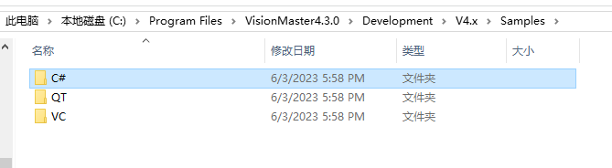
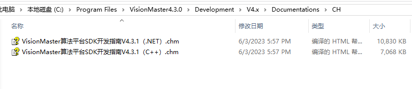
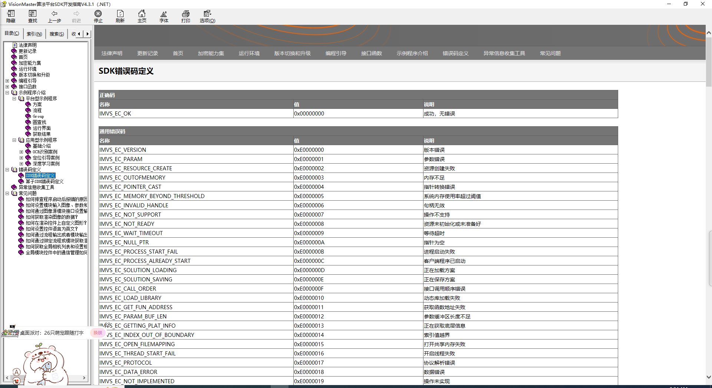

# 小技巧

import VideoPlayer from '@site/videoPlayer.js'

<VideoPlayer src="https://xian-vforum.oss-cn-hangzhou.aliyuncs.com/2022-07-04_JO5eLsTON2_1.5%E5%B0%8F%E6%8A%80%E5%B7%A7_x264.mp4"/>

1. VM安装目录

Samples内包含C#,QT,VC应用程序



Documetnations内包含C#和C语言的帮助文档





2. 错误码

```Csharp
        private void button4_Click(object sender, EventArgs e)
        {
            try
            {
                VmSolution.Load(textBox1.Text);
                listBox1.Items.Add("方案加载成功.");
                listBox1.TopIndex = listBox1.Items.Count - 1;
            }
            catch (VmException ex)
            {

                MessageBox.Show("VM SDK异常:" + Convert.ToString(ex.errorCode, 16));
            }
            catch (Exception ex) {
                MessageBox.Show("系统异常:"+ex.Message);
            }
            
        }
```

3. 资源管理

程序启动时杀死进程,关闭VM

```Csharp
        public Form1()
        {
            KillProcess("VisionMasterServerApp");
            KillProcess("VisionMaster");
            KillProcess("VmModuleProxy.exe");
            InitializeComponent();
            
        }

        private void KillProcess(string strKillName)
        {
            foreach (var item in System.Diagnostics.Process.GetProcesses())
            {
                if (item.ProcessName.Contains(strKillName))
                {
                    try
                    {
                        item.Kill();
                        item.WaitForExit();
                    }
                    catch (Exception ex)
                    {

                        Console.WriteLine(ex.Message);
                    }
                }
            }
        }
```

程序关闭时释放资源

```Csharp
        private void Form1_FormClosing(object sender, FormClosingEventArgs e)
        {
            VmSolution.Instance.Dispose();
        }
```


