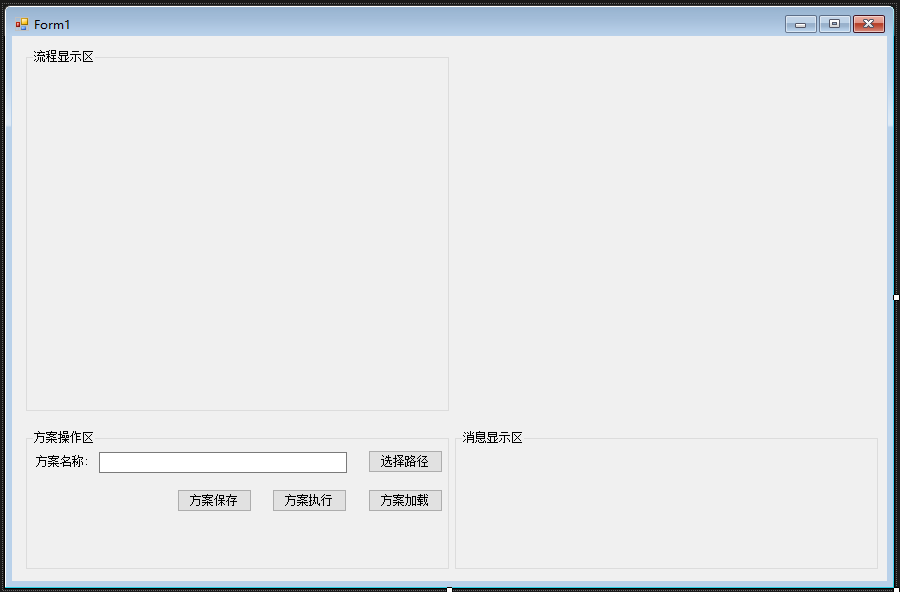
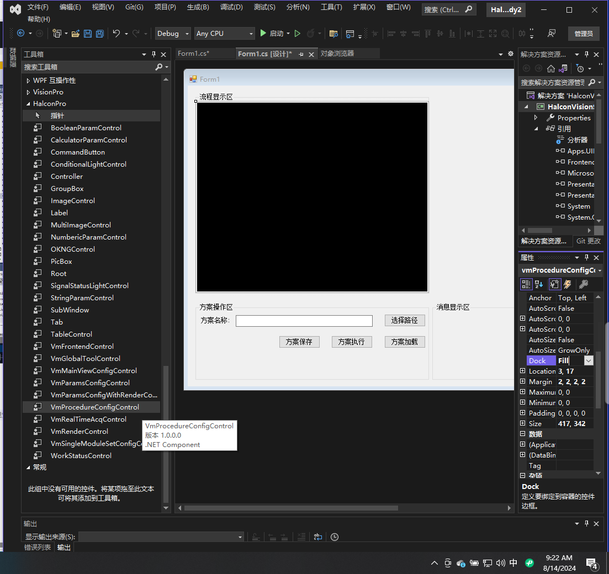
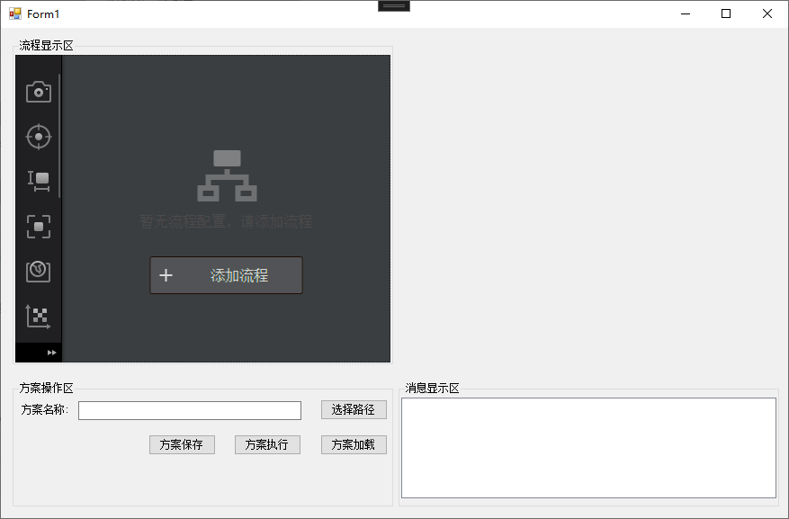

# 方案加载运行保存

方案和流程是VisionMaster(简称VM)的主要概念,一个方案可以包含多个流程,一个流程可以由多个模块通过连线建立逻辑关系.

import VideoPlayer from '@site/videoPlayer.js'

<VideoPlayer src="https://xian-vforum.oss-cn-hangzhou.aliyuncs.com/2022-07-04_YSN5RGSQkS_1.2%E6%96%B9%E6%A1%88%E5%8A%A0%E8%BD%BD%E3%80%81%E6%89%A7%E8%A1%8C%E5%8F%8A%E4%BF%9D%E5%AD%98_x264.mp4"/>

## 方案的相关操作

### 1. 界面设计

界面分为三个部分:流程显示区,方案操作区,消息显示区.添加GroupBox,文本框,文本,和一些按钮.



### 2. 流程显示区

为了将方案加载显示在界面上,我们需要添加VmProcedureConfigControl控件到流程显示区,设置Dock为Fill



### 3. 方案操作区,消息显示区

    1. 选择路径

    点击选择路径按钮,弹出选择文件夹对话框,选择方案的路径.

    ```Csharp
            private void button1_Click(object sender, EventArgs e)
            {
                OpenFileDialog openFileDialog = new OpenFileDialog();
                openFileDialog.Filter = "VM Sol File|*.sol*";
                DialogResult dialogResult = openFileDialog.ShowDialog();
                if (DialogResult.OK==dialogResult)
                {
                    textBox1.Text = openFileDialog.FileName;
                }
                listBox1.Items.Add("选择路径成功");
                listBox1.TopIndex = listBox1.Items.Count - 1;

            }
    ```

    2. 加载方案

    方案加载需要调用方案加载的相关接口,需要添加两个引用,首先需要添加VM.Core.dll，然后添加VM.PlatformSDKCS.dll.
    方案加载使用VmSolution.Load方法,参数为方案的路径.


    ```Csharp
            private void button4_Click(object sender, EventArgs e)
            {
                VmSolution.Load(textBox1.Text);
                listBox1.Items.Add("方案加载成功");
                listBox1.TopIndex = listBox1.Items.Count - 1;
            }
    ```

    3. 执行方案

    方案执行使用VmSolution.Instance.SyncRun方法,会同步执行一次方案中的所有流程.

    ```Csharp
            private void button3_Click(object sender, EventArgs e)
            {
                VmSolution.Instance.SyncRun();
                listBox1.Items.Add("方案执行一次成功");
                listBox1.TopIndex = listBox1.Items.Count - 1;
            }
    ```

    4. 保存方案

    方案保存使用VmSolution.Save方法,直接保存方案,Save方法是将方案保存到原始路径直接替换原方案.
    SaveAs方法是将方案另存至自定义的路径.

    ```Csharp
            private void button2_Click(object sender, EventArgs e)
            {
                VmSolution.Save();
                listBox1.Items.Add("方案保存成功");
                listBox1.TopIndex = listBox1.Items.Count - 1;
            }
    ```

### 4. 启动项目

    运行程序查看效果,注意在启动项目之前要关闭VM软件及后台服务.
    1. 启动

    

    2. 选择路径
    选择之前保存在项目根目录的sol文件

    

    3. 方案加载
    流程区控件会显示方案中模块内容
    

    4. 方案执行
    当方案执行完成无模块报错,模块左侧图标会显示绿色,下方菜单栏中也会显示流程执行的耗时.
    

    5. 保存方案

    点击方案保存,会将方案保存至原路径中.

    

以上就是方案操作的整个流程.


