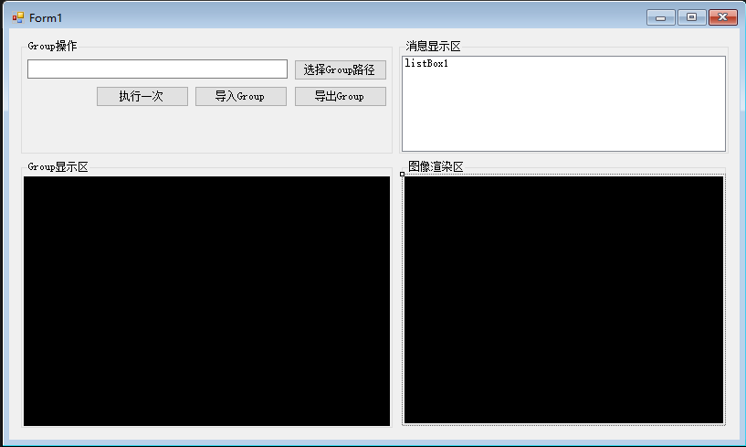
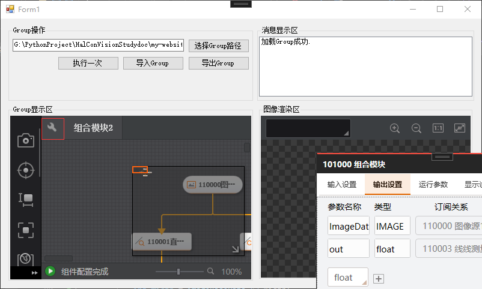

# 获取独立Group运行结果

import VideoPlayer from '@site/videoPlayer.js'

<VideoPlayer src="https://xian-vforum.oss-cn-hangzhou.aliyuncs.com/2022-07-04_WmctmDv2Er_3.2%E8%8E%B7%E5%8F%96%E7%8B%AC%E7%AB%8BGroup%E8%BF%90%E8%A1%8C%E7%BB%93%E6%9E%9C_x264.mp4"/>

## 获取渲染结果

### 1. 添加VmRenderControl控件



### 2. 配置Group设置

若要显示结果,需要配置Group输出设置和显示设置,输出图像和夹角参数,显示输出图像和两条查找到的直线和其夹角




### 3. 导出Group

保存Group后,可将Group导出至原路径.

### 4. 获取渲染结果和数据结果

```Csharp
        /// <summary>
        /// 执行一次
        /// </summary>
        /// <param name="sender"></param>
        /// <param name="e"></param>
        private void button4_Click(object sender, EventArgs e)
        {
            groupTool.Run();

            listBox1.Items.Add("执行Group成功.");
            listBox1.TopIndex = listBox1.Items.Count - 1;

            vmRenderControl1.ModuleSource = groupTool;

            string radius = groupTool.ModuResult.GetOutputFloat("out").pFloatVal[0].ToString();

            ImageBaseData_V2 imageBaseData_V2 = groupTool.ModuResult.GetOutputImageV2("ImageData");
            int width = imageBaseData_V2.Width;
            int height = imageBaseData_V2.Height;
            IntPtr imageByte = imageBaseData_V2.ImageData;
            VMPixelFormat pixelFormat = imageBaseData_V2.Pixelformat;

            listBox1.Items.Add($"角度:{ radius},图像宽:{width},高:{height},格式:{pixelFormat}");
            listBox1.TopIndex = listBox1.Items.Count - 1;
        }
```

## 5. 运行


可以看到,运行成功,并显示了角度和图像宽高格式.

## 6. 通过模块获取渲染和数据结果

```Csharp
            //也可以通过模块获取渲染结果和数据结果

            IMVSLineFindModuCs.IMVSLineFindModuTool lineFindModuTool = (IMVSLineFindModuCs.IMVSLineFindModuTool)groupTool["直线查找1"];
            vmRenderControl1.ModuleSource = lineFindModuTool;

            string strGroLineX = lineFindModuTool.ModuResult.OutputLine.StartPoint.X.ToString();
```

通过模块获取结果的方式只能获取到某个模块的结果,通过Group获取结果可以获取和订阅到多个模块的结果，推荐使用Group获取结果.


