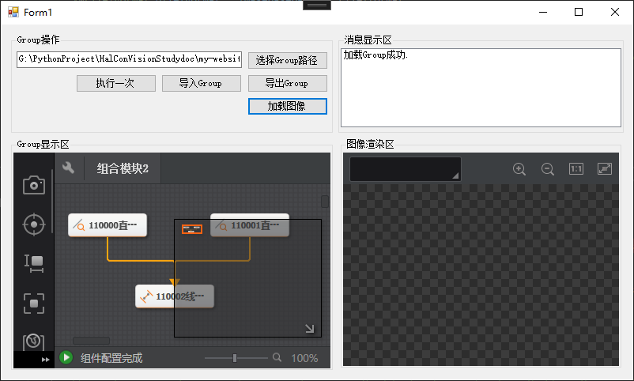

# Group外部输入图像

import VideoPlayer from '@site/videoPlayer.js'

<VideoPlayer src="https://xian-vforum.oss-cn-hangzhou.aliyuncs.com/2022-07-04_EI4qA6uSjs_3.3Group%E5%A4%96%E9%83%A8%E8%BE%93%E5%85%A5%E5%9B%BE%E5%83%8F_x264.mp4"/>

## 用OpenCV从本地读图

当Group内部无图像源模块时,可以通过代码的方式将图片传入Group内部.实现方式有多种,可以使用OpenCV从本地读图,可在程序集搜索引用OpenCvSharp，同时将其复制本地的属性改为False.

### 1. 界面设计

增加加载图像按钮


### 2. 处理加载图像点击事件

```Csharp
    private void button5_Click(object sender, EventArgs e)
        {
            //Group无图像源的输入图,用opencv从本地读图
            Mat matImage = Cv2.ImRead(Application.StartupPath + "/GroupImage.jpg", ImreadModes.Grayscale);

            uint dataLen = (uint)(matImage.Width * matImage.Height);
            ImageBaseData_V2 image = new ImageBaseData_V2(matImage.Data,dataLen,matImage.Cols,matImage.Rows,VMPixelFormat.VM_PIXEL_MONO_08);
            groupTool.ModuParams.SetInputImage_V2("ImageData0",image);

        }
```

## 用Bitmap从本地读图

```Csharp
            //用bitmap从本地读图
            Bitmap bmp = new Bitmap(Application.StartupPath+"/GroupImage.jpg");
            BitmapData bitmapData = bmp.LockBits(new Rectangle(0, 0, bmp.Width, bmp.Height), ImageLockMode.ReadOnly, PixelFormat.Format8bppIndexed);
            uint datalen = (uint)(bitmapData.Width * bitmapData.Height);
            ImageBaseData_V2 image1 = new ImageBaseData_V2(bitmapData.Scan0,datalen,bitmapData.Width,bitmapData.Height,VMPixelFormat.VM_PIXEL_MONO_08);
            groupTool.ModuParams.SetInputImage_V2("ImageData0",image1);
            bmp.UnlockBits(bitmapData);
```

## 运行

1. 选择路径,导入没有图像源的Group


2. 定义输入图像源参数名为ImageData0


3. 检查各模块图像源是否正确配置为ImageData0


4. 加载图像



5. 执行一次


可以看到,已从本地读图的图像已成功传入Group内部,两直线及其夹角也正确显示.


