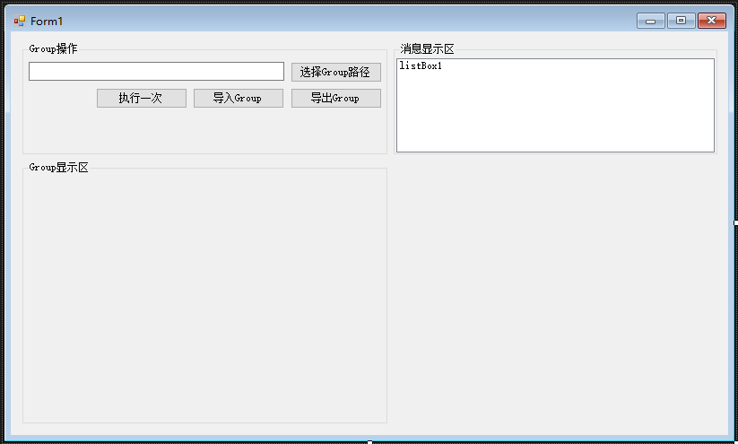
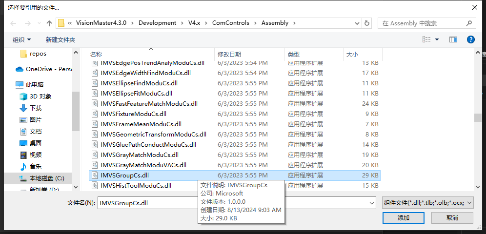
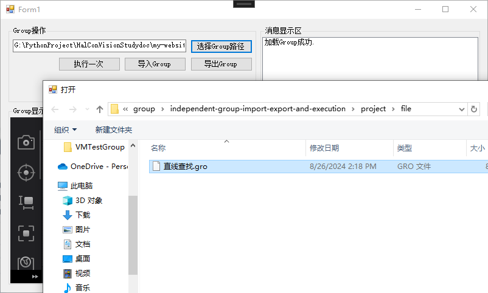
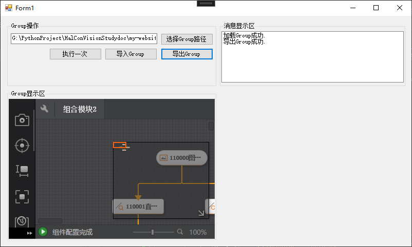

# 独立Group导入、导出及执行

import VideoPlayer from '@site/videoPlayer.js'

<VideoPlayer src="https://xian-vforum.oss-cn-hangzhou.aliyuncs.com/2022-07-04_W6pzoLrWSF_3.1%E7%8B%AC%E7%AB%8BGroup%E5%AF%BC%E5%85%A5%E3%80%81%E5%AF%BC%E5%87%BA%E5%8F%8A%E6%89%A7%E8%A1%8C_x264.mp4"/>

## 1. 界面设计



## 2. 添加引用

Group相当于VM中的模块,因此在调用相关接口函数前,需要引用对应的动态库IMVSGroupCs,同时将复制本地的属性改为False



```Csharp
using IMVSGroupCs;
```

## 3. 添加VmSingleModuleSetConfigControl控件


拖入控件后,设置Dock为Fill

## 4. 选择Group路径

```Csharp
        /// <summary>
        /// 选择Group路径
        /// </summary>
        /// <param name="sender"></param>
        /// <param name="e"></param>
        private void button1_Click(object sender, EventArgs e)
        {
            OpenFileDialog fileDialog = new OpenFileDialog();
            fileDialog.Filter = "VM Gro File|*.gro*";
            DialogResult openFileRes = fileDialog.ShowDialog();
            if (openFileRes==DialogResult.OK)
            {
                textBox1.Text = fileDialog.FileName;
            }
        }
```

 5. 导入Group

 ```Csharp
        /// <summary>
        /// 导入Group
        /// </summary>
        /// <param name="sender"></param>
        /// <param name="e"></param>
        private void button3_Click(object sender, EventArgs e)
        {
            string strMsg = null;
            try
            {
                groupTool = IMVSGroupTool.LoadIndependentGroup(textBox1.Text);
                vmSingleModuleSetConfigControl1.ModuleSource = groupTool;
                
            }
            catch (VmException ex)
            {
                strMsg = "加载Group失败.异常码:"+Convert.ToString(ex.errorCode,16);
            }
            strMsg = "加载Group成功.";
            listBox1.Items.Add(strMsg);
            listBox1.TopIndex = listBox1.Items.Count - 1;
        }
```

## 6. 导出Group

```Csharp
        /// <summary>
        /// 导出Group
        /// </summary>
        /// <param name="sender"></param>
        /// <param name="e"></param>
        private void button2_Click(object sender, EventArgs e)
        {
            groupTool.Save();
        }
```

## 7. 执行Group

```Csharp
        /// <summary>
        /// 执行一次
        /// </summary>
        /// <param name="sender"></param>
        /// <param name="e"></param>
        private void button4_Click(object sender, EventArgs e)
        {
            groupTool.Run();
        }
```

## 8. 运行

1. 选择路径



2. 导入Group


3. 导出Group

可将Group保存至原路径.



4. 执行Group

可将Group执行一次


