# 常见问题排查

import VideoPlayer from '@site/videoPlayer.js'

<VideoPlayer src="https://xian-vforum.oss-cn-hangzhou.aliyuncs.com/2022-07-19_fscLSsDXde_VM%E5%BC%80%E5%8F%91%E5%B8%B8%E8%A7%81%E9%97%AE%E9%A2%98%E6%8E%92%E6%9F%A5.mp4"/>

## VMSDK开发

### 常见问题排查思路

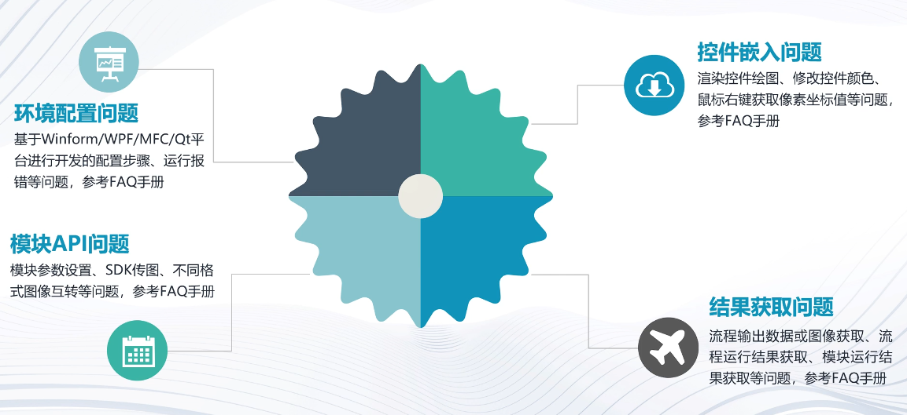

### 环境配置问题

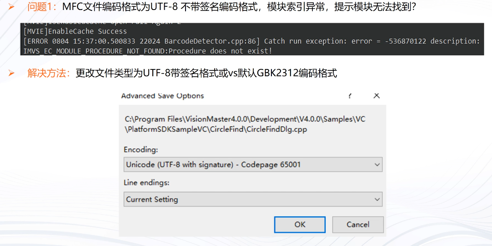

### 模块API问题

### 控件嵌入问题

### 结果获取问题

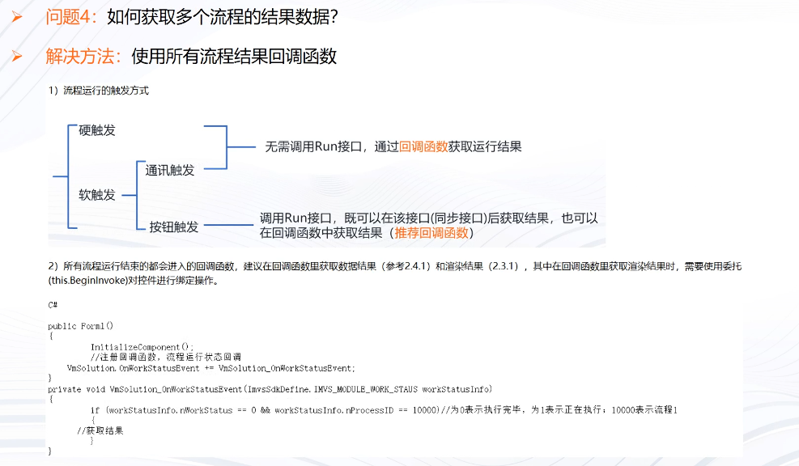

## 算子SDK开发

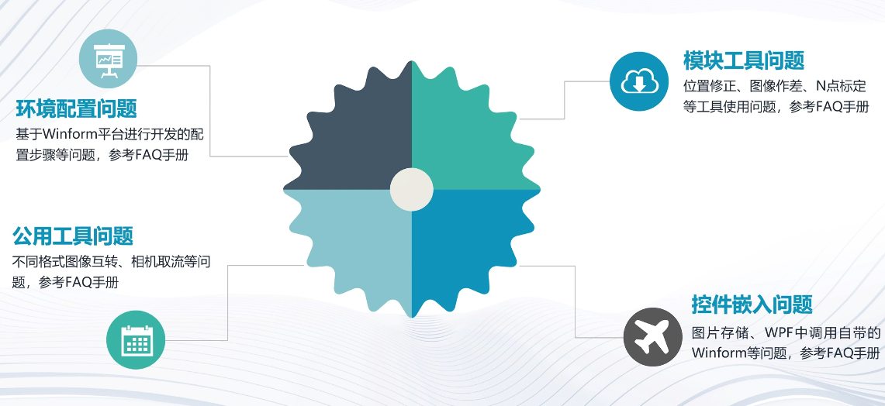

### 环境配置问题

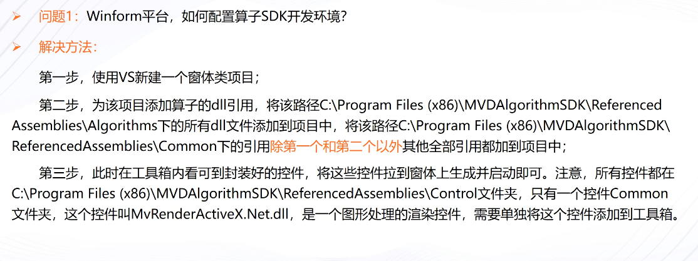

### 公用工具问题

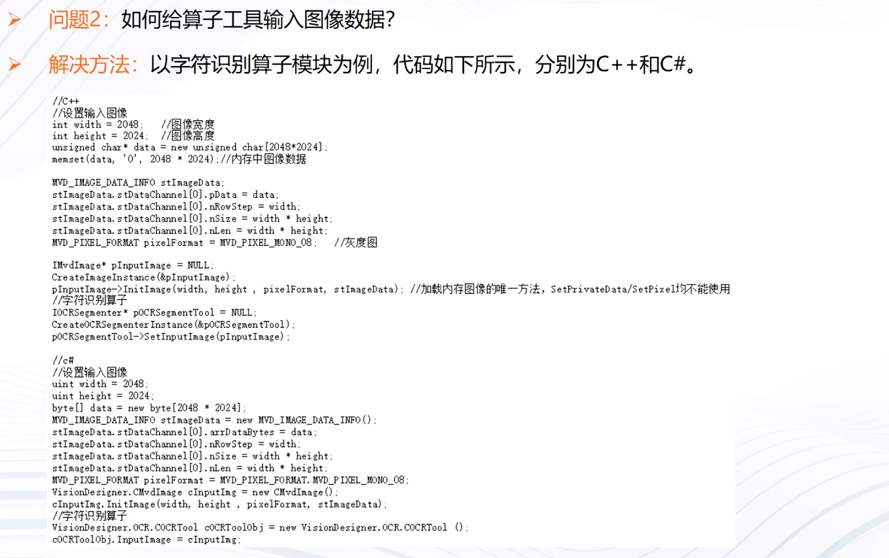

### 模块工具问题

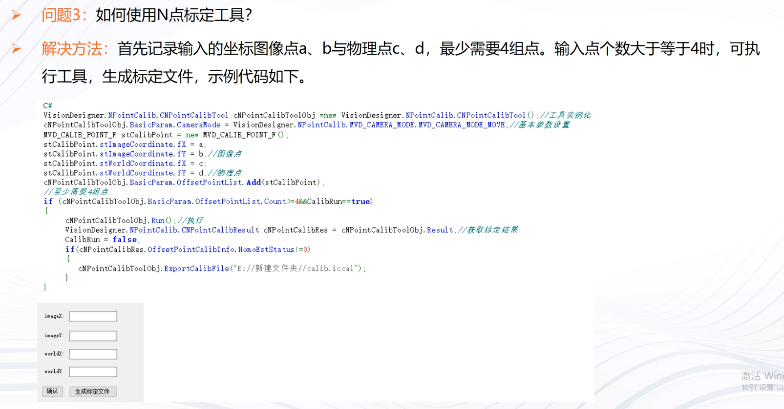

### 控件嵌入问题

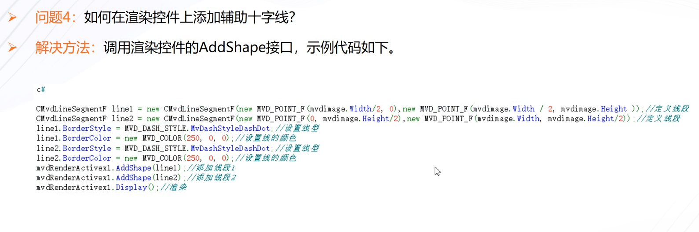

## VM算法开发

### 常见问题排查思路

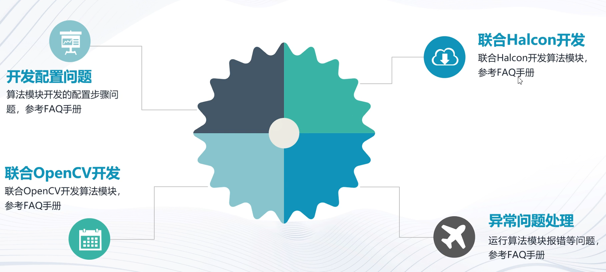

### 开发配置问题

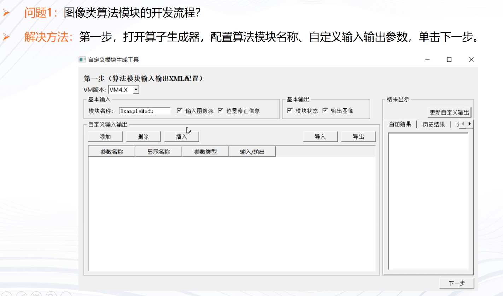

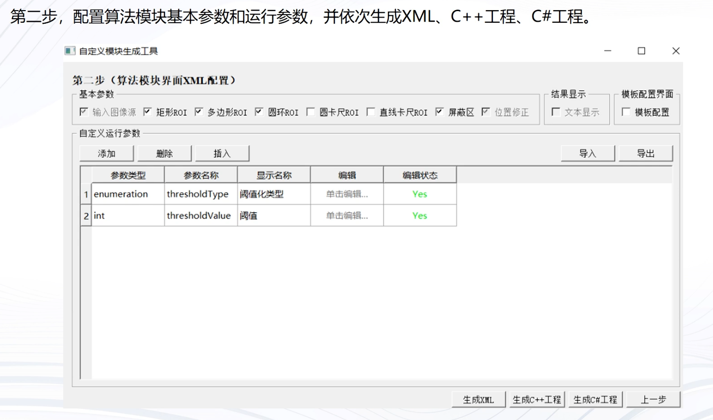

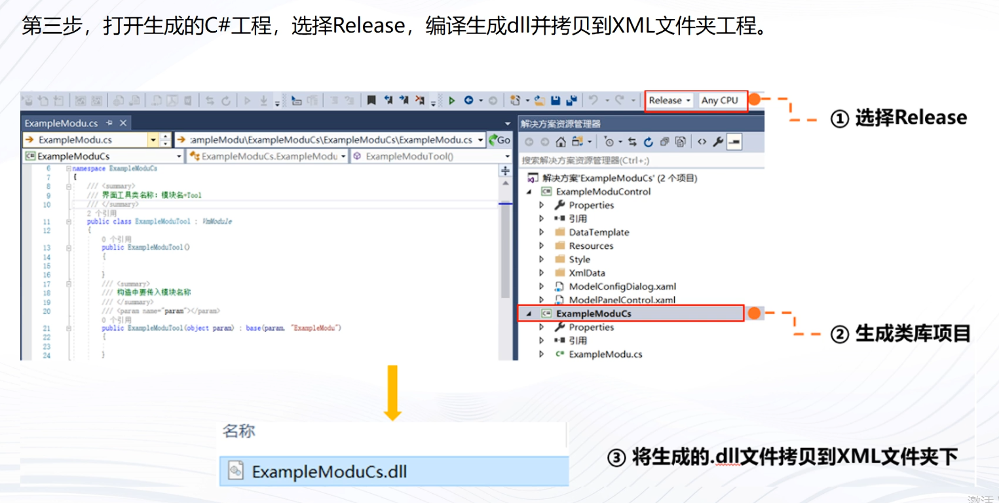

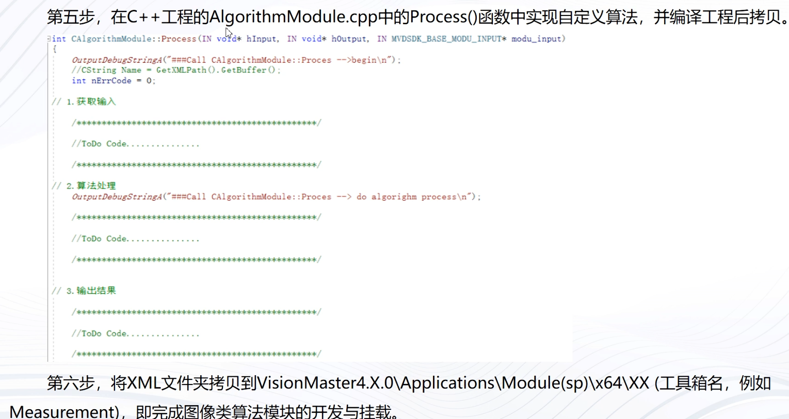

### 联合OpenCV开发

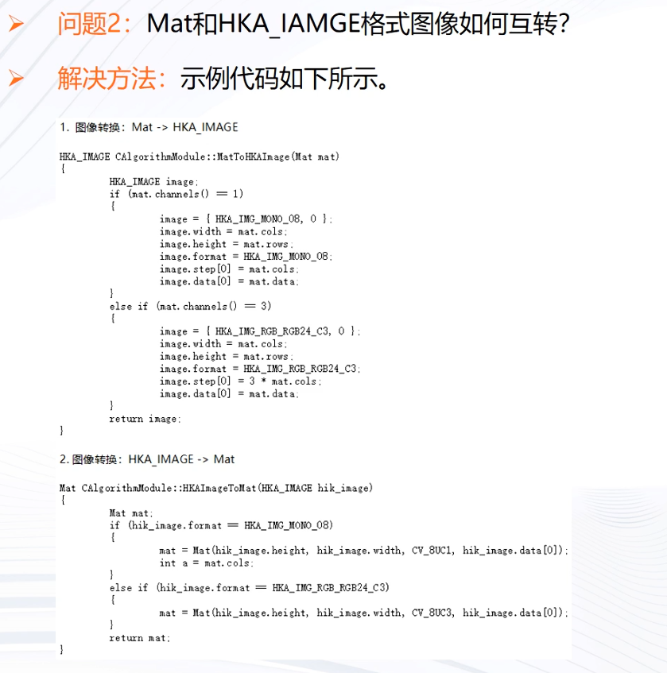

### 联合Halcon开发

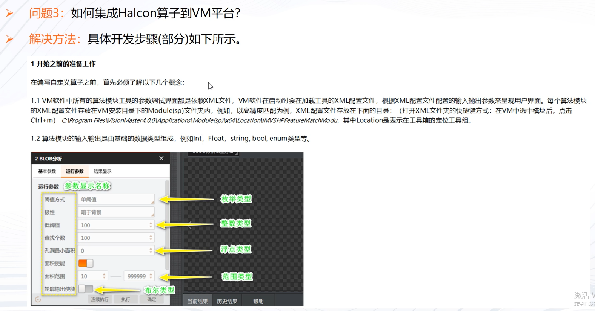

### 异常问题处理

### 常见问题排查-配套资料

### 常见问题排查-方法总结

