# 自定义算法模块开发

import VideoPlayer from '@site/videoPlayer.js'

<VideoPlayer src="https://xian-vforum.oss-cn-hangzhou.aliyuncs.com/2022-07-19_4lZDUsiEy2_%E8%87%AA%E5%AE%9A%E4%B9%89%E7%AE%97%E6%B3%95%E6%A8%A1%E5%9D%97%E5%BC%80%E5%8F%91_x264.mp4"/>

## 开放模块框架

VM4.2的开放特性将赋予用户在实际项目应用中更多的可能性，VM4.2进一步开放了软件模块框架，用户可以将自行开发的算法封装后，挂载到VM中，直接从工具箱中拖入流程后，即可配合原生VM工具一起使用。

## 三步操作封装

VM4.2提供模块生成工具来辅助用户进行自定义算法的嵌入，可以预生成大部分接口代码，开发者通过此工具，只需要简单的三步操作就可以将自己开发算法封装成VM模块，极大缩短了开发周期。

# 什么是算法模块

## 三层架构

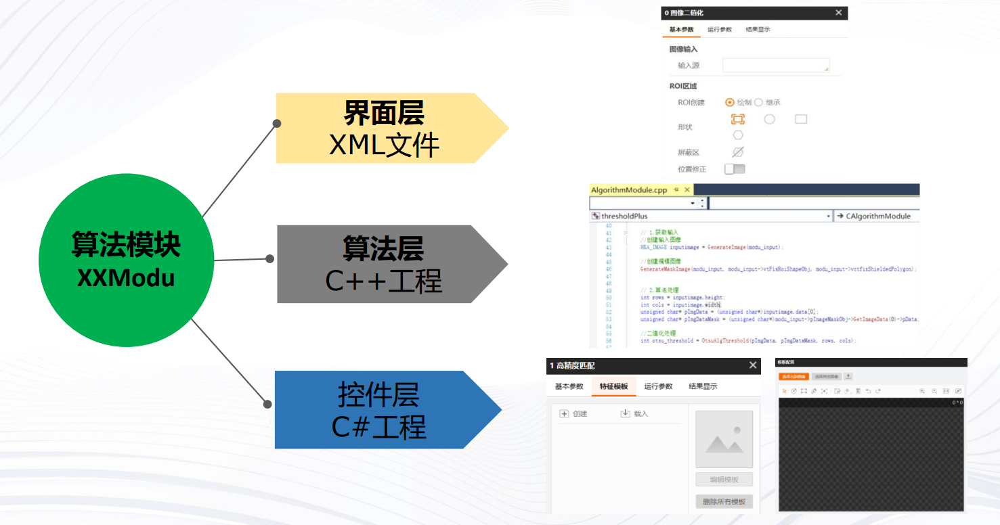

## 组成要素

# 模版创建

## 模板创建流程

### 第一步:基本参数配置

### 第二步:运行参数配置

## 控件层工程

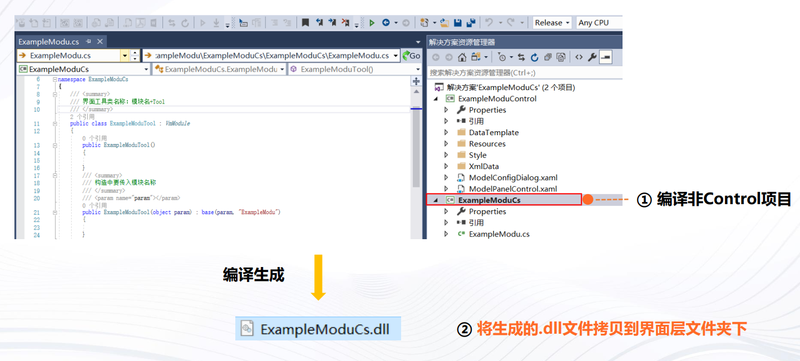

## 算法层工程

## 界面层工程

## 模版集成演示

将界面文件夹拷贝至VisionMaster4.2.0\Applications\Module(sp)\x64\XX(工具箱名，例如Measurement)

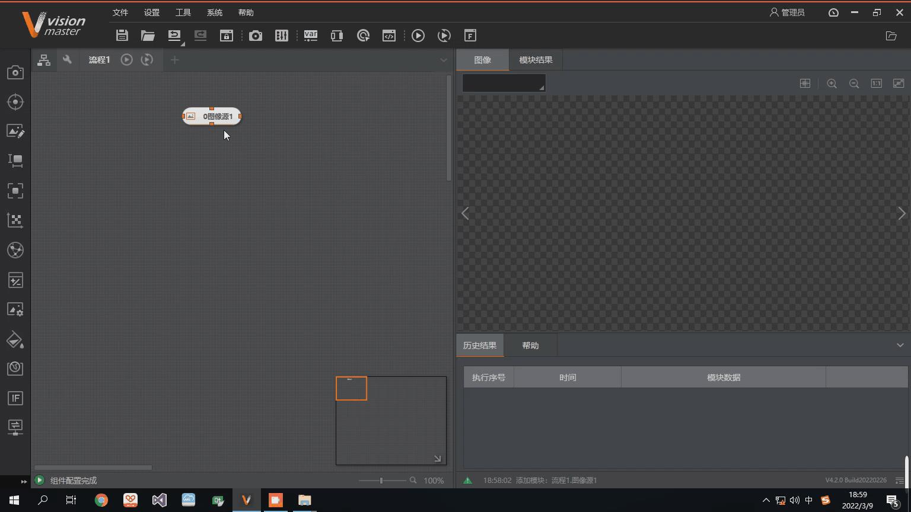

# 算法开发

## 获取输入

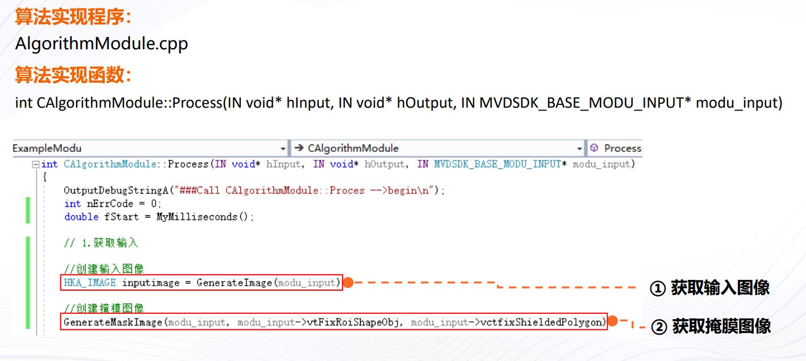

## 输入函数详解

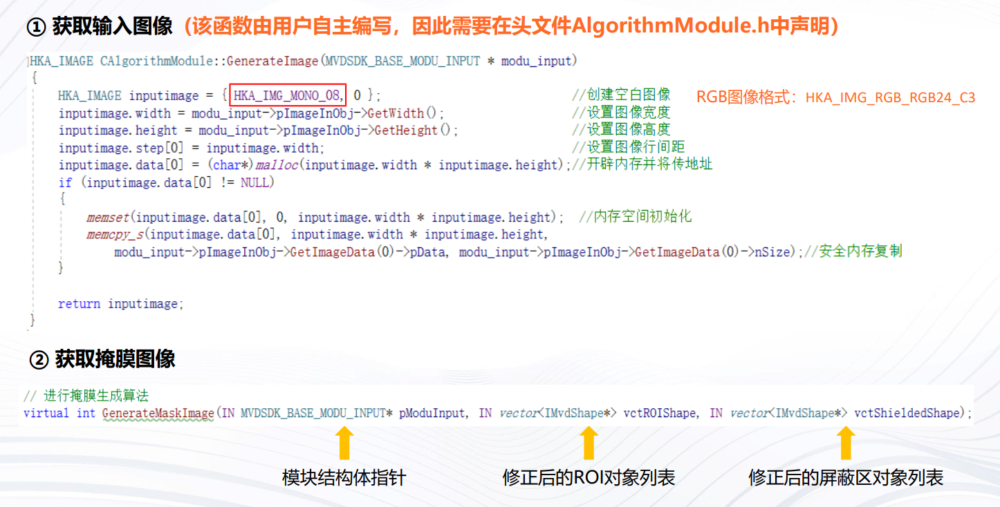

## 输入掩摸详解

掩膜图像由输入图像、ROI和屏蔽区组成，对待处理的图像进行遮挡，用来控制图像处理的区域。
1. ROI区域内且屏蔽区外，图像灰度值为255，能够被算法处理；
2. ROI区域内且屏蔽区内，或ROI区域外，图像灰度值为0，不能够被算法处理。

## 算法处理:阈值化

## 输出结果

## 模块运行演示

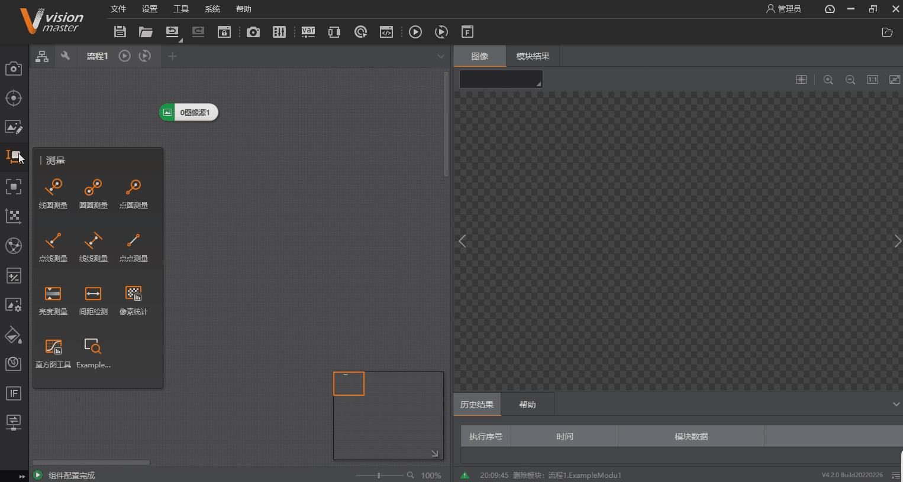

# 添加中英文资源

最后介绍如何给算法模块添加中英文资源(给模块添加中文名称等)

1. 使用VisionMaster4.2.0\Applications\Lang中LanguageTool工具，给算法模块增加中英文资源。

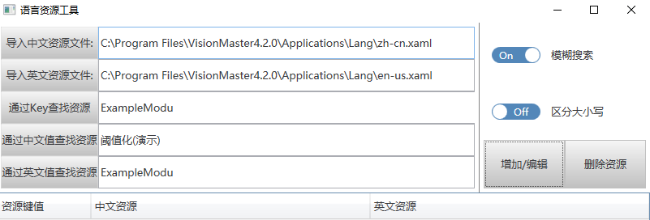

2. 重新打开VM，模块资源添加成功

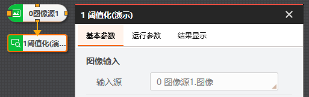

# 拓展知识：获取灰度/彩色图像

# 拓展知识：获取图像时不拷贝内存

注意：该方式下，改写图像数据可能影响前序/后续模块的图像数据，用户需深拷贝后再修改图像数据

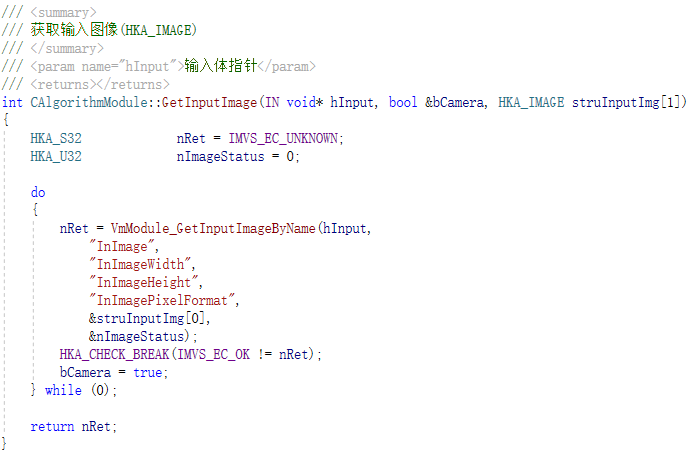

# 添加外部库

## 集成OpenCV

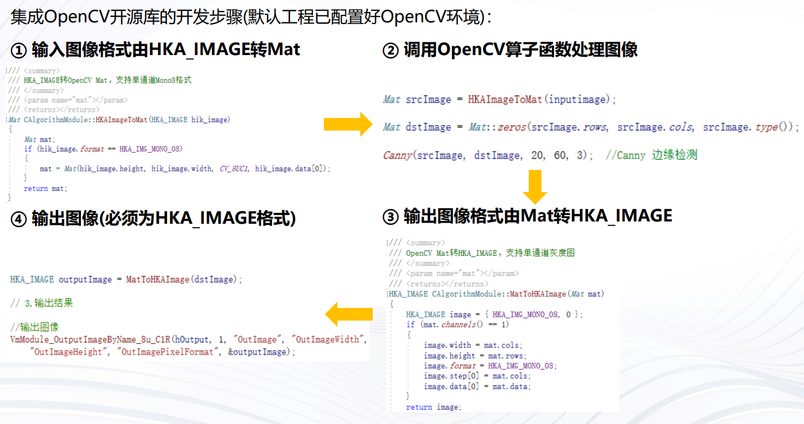

## 运行演示

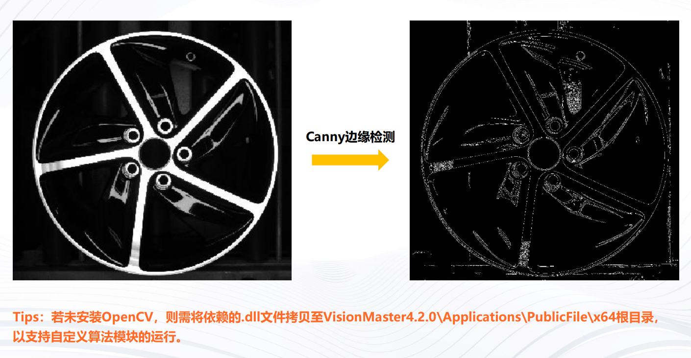

# 多版本升级:旧版本的模块升级到新版本

## 模块升级:升级界面库

1. 打开界面层工程，移除框选dll的引用，重新添加VM4.2 安装目录下对应动态库的引用，重新编译工程

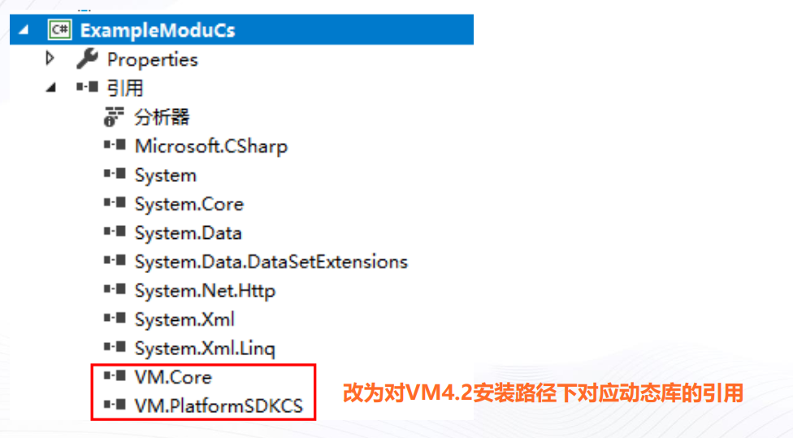

2. 打开算法层工程，将common文件夹替换为VM4.2安装目录指定路径下的common文件夹

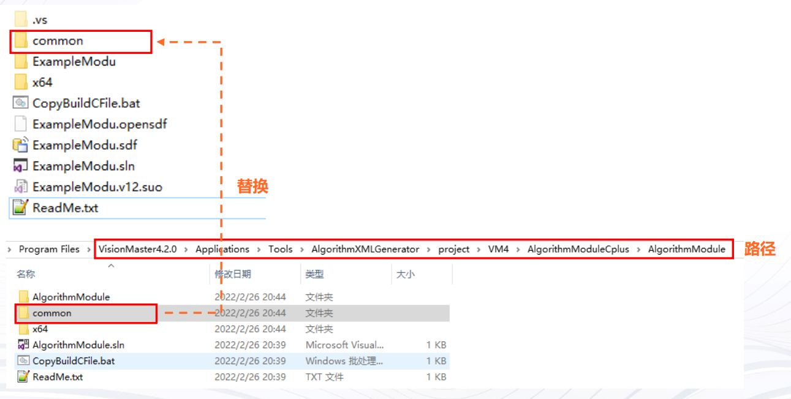

3. 打开AlgorithmModule.cpp，在Init()方法中添加如下代码，重新编译工程

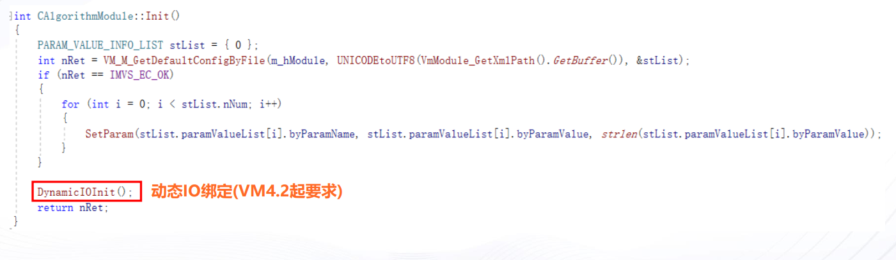

## 模块升级:常见问题

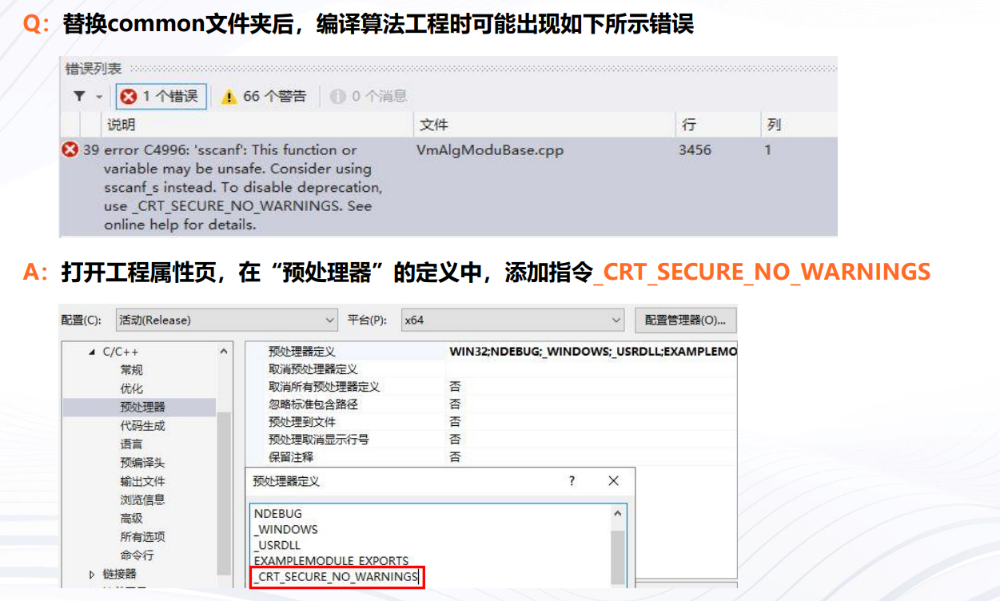

