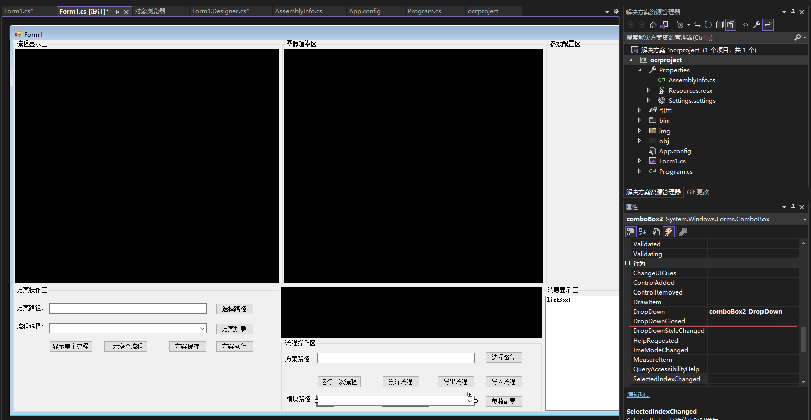
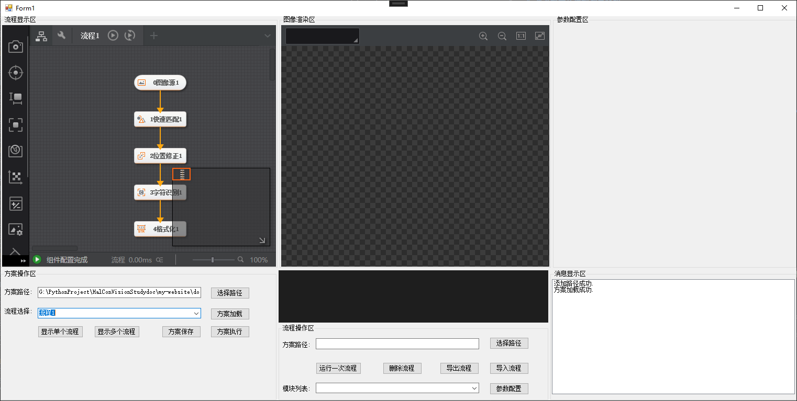
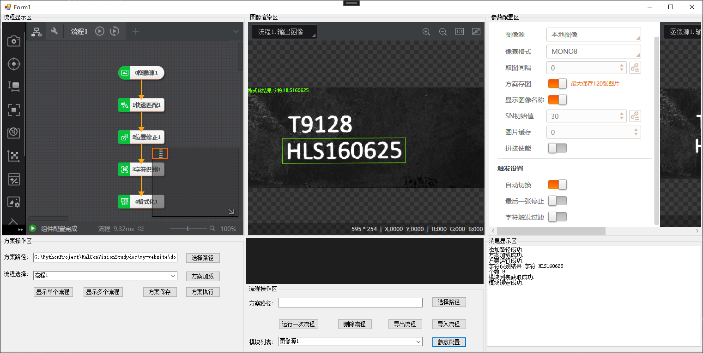
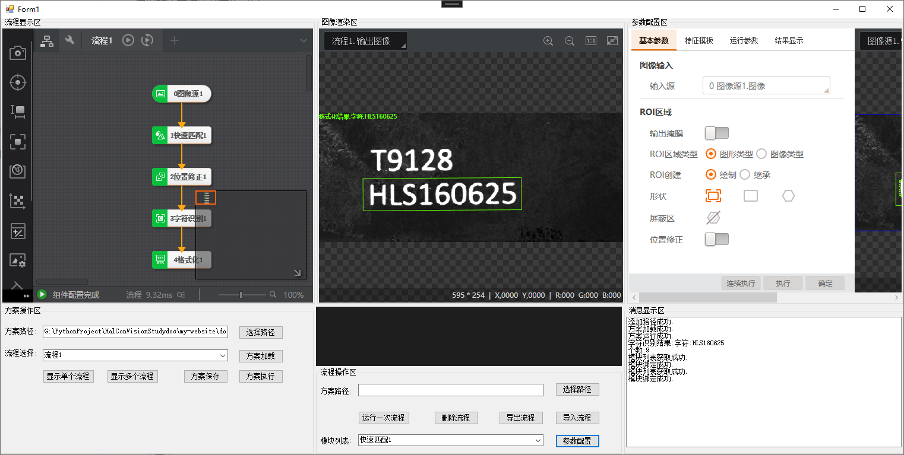
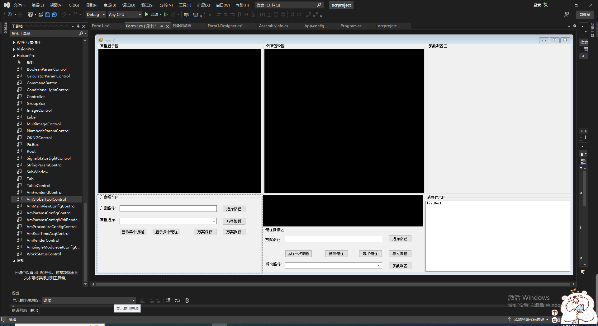
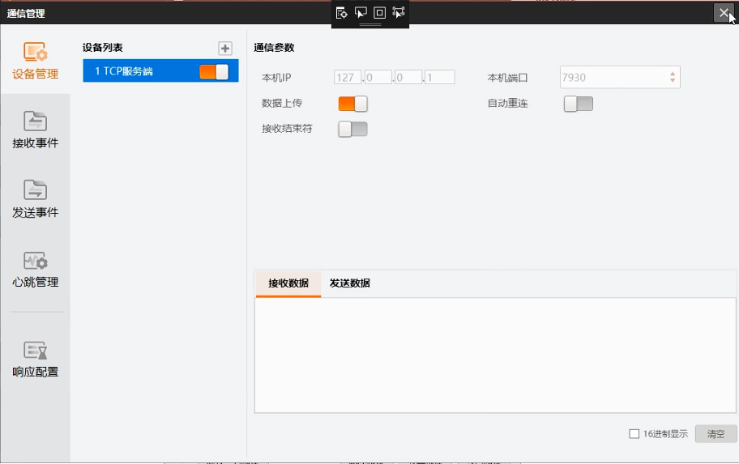
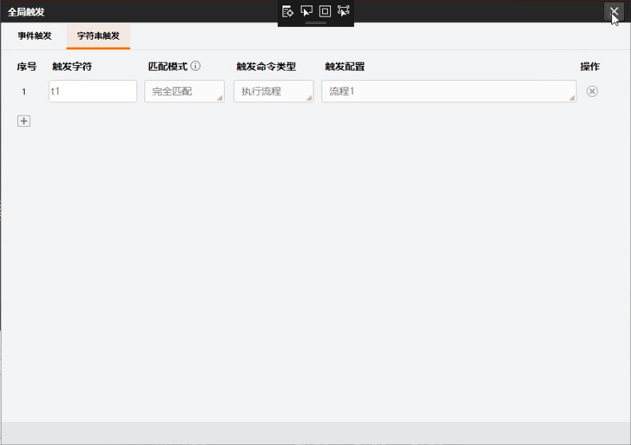
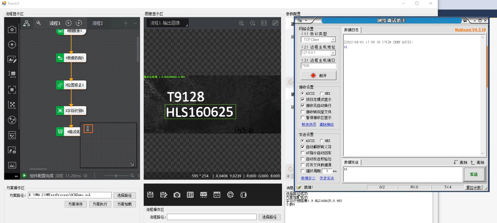

# 通讯触发及模块列表获取

import VideoPlayer from '@site/videoPlayer.js'

<VideoPlayer src="https://xian-vforum.oss-cn-hangzhou.aliyuncs.com/2022-07-04_ehbfMfmlFh_2.4%E9%80%9A%E8%AE%AF%E8%A7%A6%E5%8F%91%E5%8F%8A%E6%A8%A1%E5%9D%97%E5%88%97%E8%A1%A8%E8%8E%B7%E5%8F%96_x264.mp4"/>

## 模块列表获取

获取流程中所有模块的模块名,添加下拉框用于显示模块名

### 1. 处理Combox2的DropDown事件

```Csharp
        /// <summary>
        /// 模块列表获取
        /// </summary>
        /// <param name="sender"></param>
        /// <param name="e"></param>
        private void comboBox2_DropDown(object sender, EventArgs e)
        {
            RunTryCatch(() => {
                VmProcedure vmProcedure = (VmProcedure)VmSolution.Instance[comboBox1.Text];
                comboBox2.Items.Clear();
                ModuleInfoList moduleInfoList = vmProcedure.GetAllModuleList();
                for (int i = 0; i < moduleInfoList.nNum; i++)
                {
                    comboBox2.Items.Add(moduleInfoList.astModuleInfo[i].strDisplayName);
                }
            },"模块列表获取成功.");
            
        }
```

### 2. 运行程序



选择路径,方案加载,流程选择



查看模块列表


流程的所有模块列表均已显示

## 模块参数配置

### 1. 处理模块参数配置按钮点击事件

```Csharp
        /// <summary>
        /// 动态绑定模块进行参数配置
        /// </summary>
        /// <param name="sender"></param>
        /// <param name="e"></param>
        private void button12_Click(object sender, EventArgs e)
        {
            RunTryCatch(() => {
                VmModule vmModule = (VmModule)VmSolution.Instance[comboBox1.Text+"."+ comboBox2.Text];
                vmParamsConfigWithRenderControl1.ModuleSource = vmModule;
            },"模块绑定成功.");
           
        }
```

### 2. 运行程序

模块列表选择模块,进行参数配置






## 通讯触发

### 使用全局工具控件实现通讯触发

拖动工具箱中的VmGlobalToolControl控件拖入主界面用于通讯触发配置



运行程序,通过全局控件可直接打开通信管理界面


创建服务端



配置全局触发





发送t1,流程触发成功.


