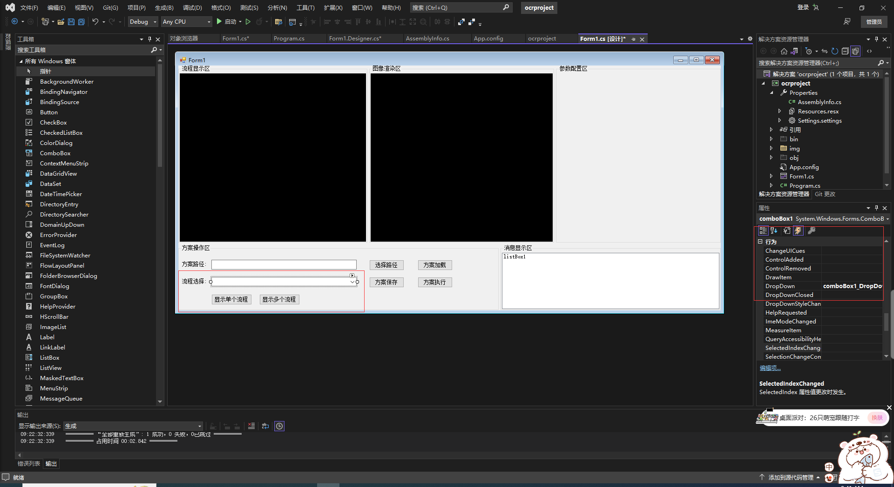
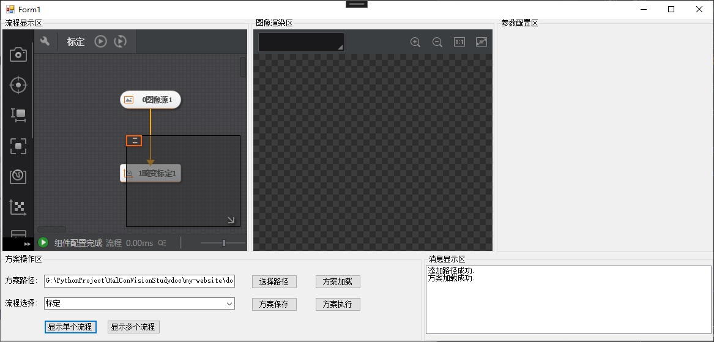

# 流程列表获取

import VideoPlayer from '@site/videoPlayer.js'

<VideoPlayer src="https://xian-vforum.oss-cn-hangzhou.aliyuncs.com/2022-07-04_4T6YFtqAht_2.1%E6%B5%81%E7%A8%8B%E5%88%97%E8%A1%A8%E8%8E%B7%E5%8F%96_x264.mp4"/>

## 流程列表获取

一个方案包含多个流程,该如何获取流程名呢?

1. 从工具箱中拖拉comboBox控件到窗体中.生成Combox下拉事件-DropDown



2. 运行程序,加载方案


可以看到这个方案有两个流程,Combox控件中显示了这两个流程名.

如何切换单个或多个流程呢?

## 切换单个流程

1. 处理显示单个流程点击事件

```Csharp
        /// <summary>
        /// 流程区绑定单个流程
        /// </summary>
        /// <param name="sender"></param>
        /// <param name="e"></param>
        private void button5_Click(object sender, EventArgs e)
        {
            try
            {
                vmProcedureConfigControl1.BindSingleProcedure(comboBox1.Text);
            }
            catch (VmException ex)
            {

                MessageBox.Show(Convert.ToString(ex.errorCode,16));
            }
        }
```

2. 运行程序,切换显示单个流程


## 切换多个流程

1. 处理显示多个流程点击事件

```Csharp
        /// <summary>
        /// 流程区绑定多个流程
        /// </summary>
        /// <param name="sender"></param>
        /// <param name="e"></param>
        private void button6_Click(object sender, EventArgs e)
        {
            try
            {
                vmProcedureConfigControl1.BindMultiProcedure();
            }
            catch (VmException ex)
            {

                MessageBox.Show(Convert.ToString(ex.errorCode, 16));
            }
        }
```

2. 运行程序,切换显示多个流程




点击显示单个流程,标定流程显示,点击显示多个流程,标定校正流程都显示.


