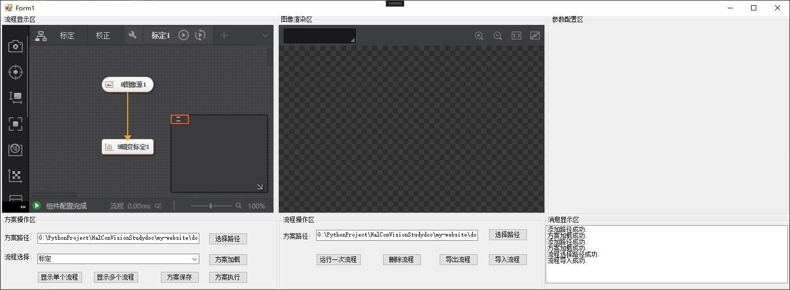
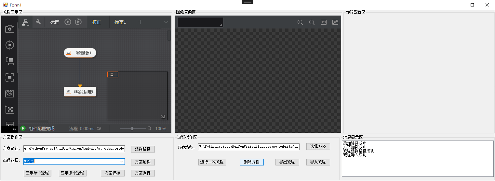
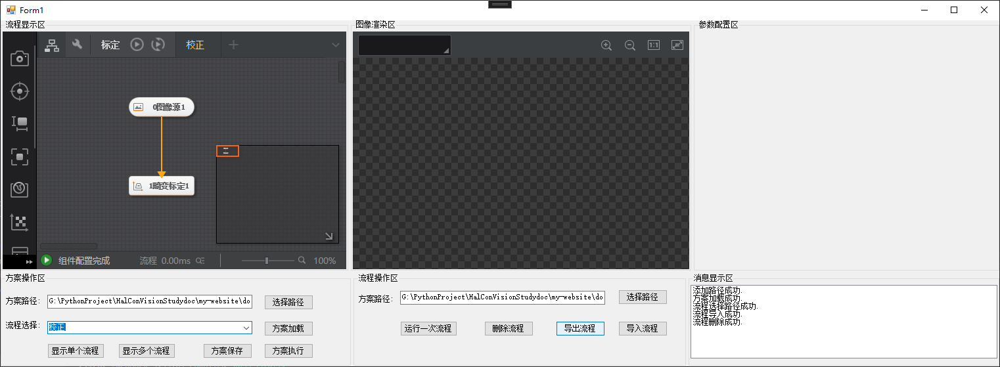
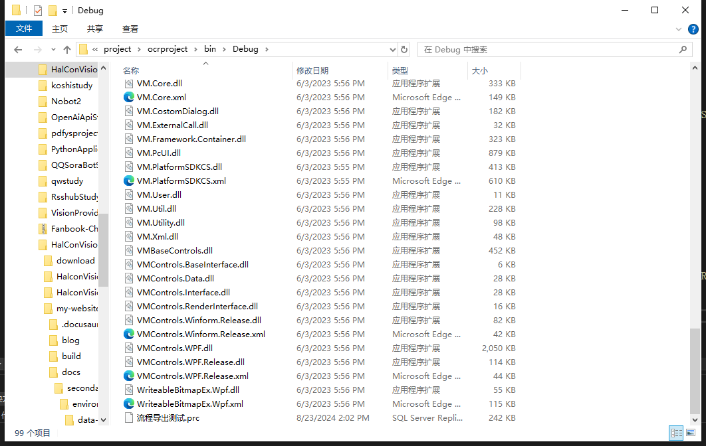

# 流程相关操作

import VideoPlayer from '@site/videoPlayer.js'

<VideoPlayer src="https://xian-vforum.oss-cn-hangzhou.aliyuncs.com/2022-07-04_FVpsg0yC1v_2.2%E6%B5%81%E7%A8%8B%E7%9B%B8%E5%85%B3%E6%93%8D%E4%BD%9C_x264.mp4"/>

## 流程相关操作

流程的相关操作包括选择路径,导入流程,导出流程,运行流程等.

在开始前,扩展优化一下写法,供其他地方重复调用.

```Csharp
        /// <summary>
        /// 消息显示区显示消息
        /// </summary>
        /// <param name="msg"></param>
        public void AddMsg(string msg) {
            listBox1.Items.Add(msg);
            listBox1.TopIndex = listBox1.Items.Count - 1;
        }

        /// <summary>
        /// TryCatch捕获SDK异常,系统异常
        /// </summary>
        /// <param name="excute"></param>
        /// <param name="msg"></param>
        public void RunTryCatch(Action excute,string msg) {
            try
            {
                excute();
                AddMsg(msg);
            }
            catch (VmException ex)
            {
                MessageBox.Show(Convert.ToString(ex.errorCode, 16));
            }
            catch (Exception ex) {
                MessageBox.Show(ex.Message);
            }
        }
```

### 选择路径

```Csharp
         /// <summary>
        /// 选择流程路径
        /// </summary>
        /// <param name="sender"></param>
        /// <param name="e"></param>
        private void button7_Click(object sender, EventArgs e)
        {
            OpenFileDialog openFileDialog = new OpenFileDialog();
            openFileDialog.Filter = "VM Prc Files|*.prc*";
            if (openFileDialog.ShowDialog() == DialogResult.OK)
            {
                RunTryCatch(() =>
                {
                    textBox2.Text = openFileDialog.FileName;
                }, "流程选择路径成功.");
            }
        }
```

### 导入流程

```Csharp
        /// <summary>
        /// 导入流程
        /// </summary>
        /// <param name="sender"></param>
        /// <param name="e"></param>
        private void button11_Click(object sender, EventArgs e)
        {
            RunTryCatch(() => {VmProcedure.Load(textBox2.Text, "");},
                "流程导入成功.");
        }
```

### 导出流程

```Csharp
        /// <summary>
        /// 导出流程
        /// </summary>
        /// <param name="sender"></param>
        /// <param name="e"></param>
        private void button10_Click(object sender, EventArgs e)
        {
            RunTryCatch(() => {VmProcedure vmProcedure = (VmProcedure)VmSolution.Instance[comboBox1.Text];vmProcedure.SaveAs("E:\\测试保存流程.prc");}, 
                "流程保存成功.");
        }
```

### 运行流程

```Csharp
        /// <summary>
        /// 运行流程
        /// </summary>
        /// <param name="sender"></param>
        /// <param name="e"></param>
        private void button8_Click(object sender, EventArgs e)
        {
            RunTryCatch(() => {VmProcedure vmProcedure = (VmProcedure)VmSolution.Instance[comboBox1.Text];vmProcedure.Run();/*vmProcedure.ContinuousRunEnable = true;流程连续运行*/},
                $"运行一次流程{comboBox1.Text}成功.");
        }
```


### 删除流程

```Csharp
        /// <summary>
        /// 流程删除
        /// </summary>
        /// <param name="sender"></param>
        /// <param name="e"></param>
        private void button9_Click(object sender, EventArgs e)
        {
            RunTryCatch(() => { VmSolution.Instance.DeleteOneProcedure(comboBox1.Text); }, "流程删除成功.");
        }
```

## 界面效果

1. 运行程序,加载方案


2. 选择流程路径,导入流程



可以看到,在方案内新增加了刚导入的标定1流程.

3. 选择流程,删除




对应流程删除成功.

4. 导出流程




导出到项目根目录下,导出成功.



5. 运行流程


流程已运行成功.对应工具显示为绿色被正常执行.


