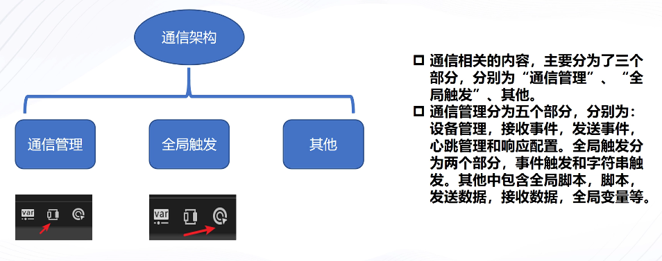
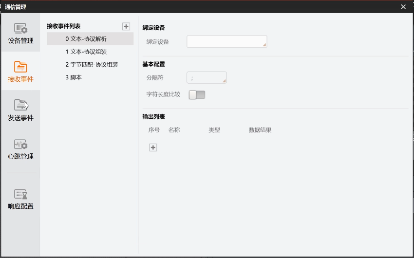
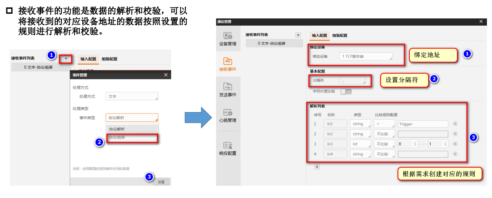
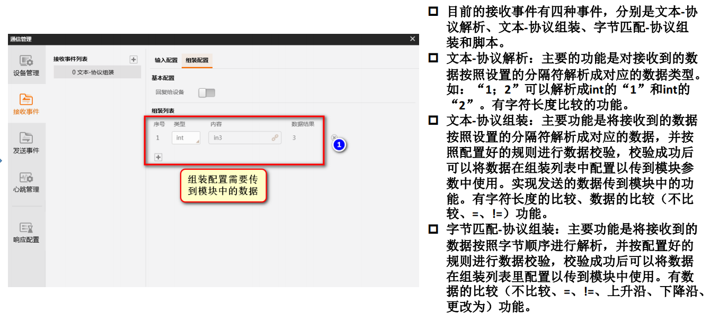
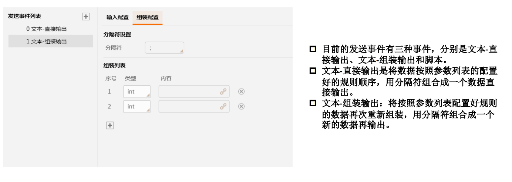

# 通信框架介绍

import VideoPlayer from '@site/videoPlayer.js'

<VideoPlayer src="https://xian-vforum.oss-cn-hangzhou.aliyuncs.com/2022-07-15_6tLmL1yAmz_%E9%80%9A%E4%BF%A1%E6%A1%86%E6%9E%B6%E4%BB%8B%E7%BB%8D_x264.mp4"/>

## 1. 通信的用途
用途: 通信是连通算法平台和外部设备的重要渠道，在算法平台中既支持外部数据
的读入也支持数据的写出，当通信构建起来以后既可以把软件处理结果发送
给外界，又可以通过外界发送字符来触发相机拍照或者软件运行。
## 2. 通信的种类介绍

## 3. 通信的基础使用方式

### 通信管理

1. 设备管理

2. 接收事件

接收事件可将通信接收到的数据进行解析,使其从一段数据解析为需要的值,也可将接收到的数据重新或自定义数据组装再发回通信设备,并可在全局触发中通过配置事件触发来响应接收事件后的操作

3. 发送事件

4. 设置心跳

5. 响应配置

### 全局触发

### 其他

