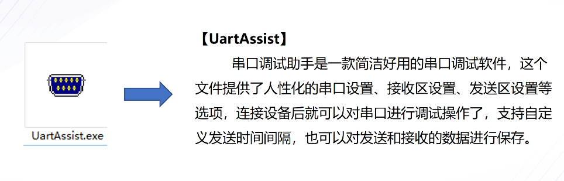
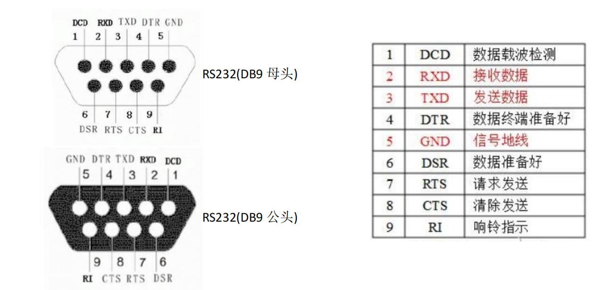
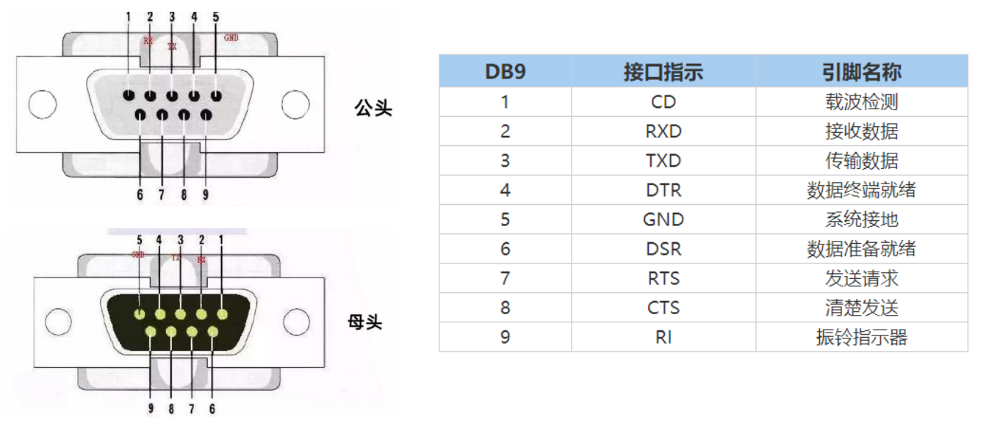
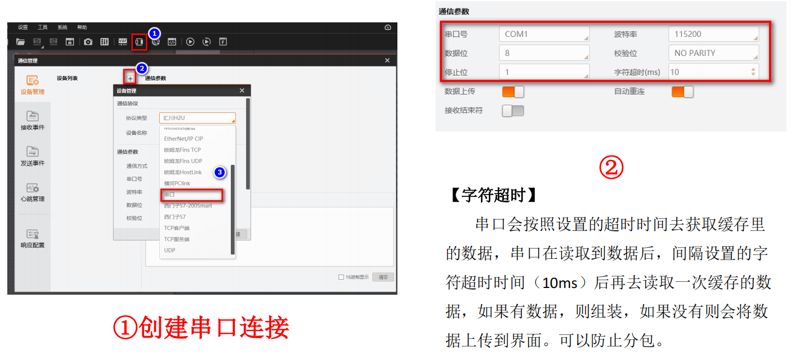
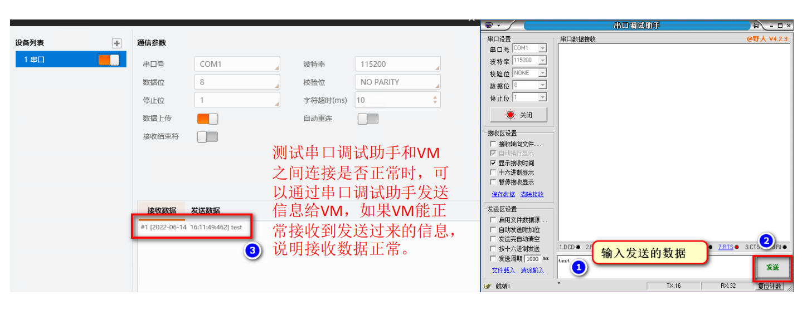

# 串口通信演示

import VideoPlayer from '@site/videoPlayer.js'

<VideoPlayer src="https://xian-vforum.oss-cn-hangzhou.aliyuncs.com/2022-07-15_QALVYgSwGG_%E4%B8%B2%E5%8F%A3%E9%80%9A%E4%BF%A1%E6%BC%94%E7%A4%BA_x264.mp4"/>

## 测试工具

## 协议介绍

## 串口在VM中的使用

### 1. RS232信号线定义

### 2. RS485信号线定义

### 3. 创建串口连接

## 4. 测试VM中串口接收数据

