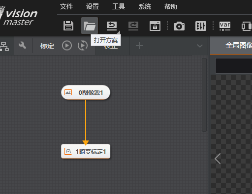
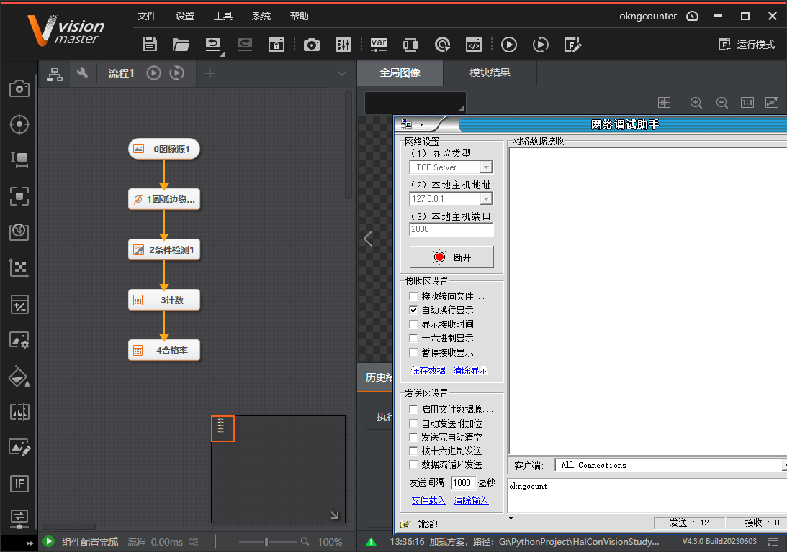

# 使用通信切换方案

import VideoPlayer from '@site/videoPlayer.js'

<VideoPlayer src="https://www.hikrobotics.com/cn2/source/vision/video/2021/6/25/20210625073523824.mp4"/>

## 使用通信切换方案

在VisionMaster中，用户可以使用通信功能来进行方案的切换，该使用方式能提升生产现场的自动化程度，便于VisionMaster与其他设备进行协同操作。

本文介绍VisionMaster中使用通信切换方案的基本操作步骤。以VisionMaster 4.2，TCP通信配置做示例，演示两个方案通过TCP通信的字符串进行切换。

## 方案切换设置步骤

1. 加载方案

2. 通信管理

点击创建建立通信

3. 保存方案

将通信设置保存到方案中

4. 加载另一方案,重复同样步骤

5. 方案设置

6. 方案切换

可以看到，方案切换成功

