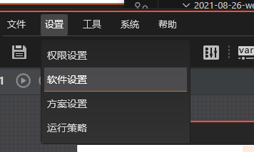
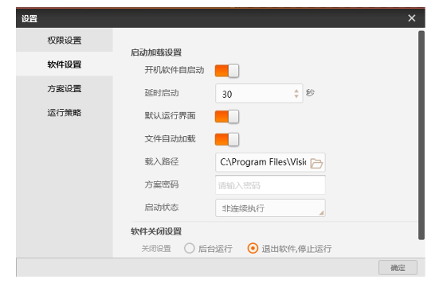
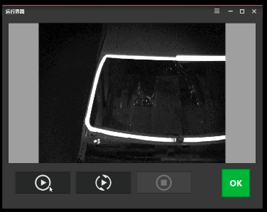

# 开机自启动

在实际应用中，用户会希望机台上电开机后，软件能自启动避免现场人员误操作，减少机台重新上电时的操作步骤以提升效率。

import VideoPlayer from '@site/videoPlayer.js'

<VideoPlayer src="https://www.hikrobotics.com/cn2/source/vision/video/2021/6/25/20210625075822851.mp4"/>

## 设置

1. 打开VM,点击设置,软件设置->开机自启动->勾选开机自启动->确定

2. 默认运行界面
启动时以设定的界面运行而非VM主界面

3. 文件自动加载
可选择软件启动是否加载指定方案,需要选择方案存储路径

按如上参数设置后,用户开机启动无需额外操作

4. 注意

延时启动时间会受主机系统启动快慢影响，
一般设置为30-90为宜，不建议设置过大

启动状态不建议设置为连续执行

