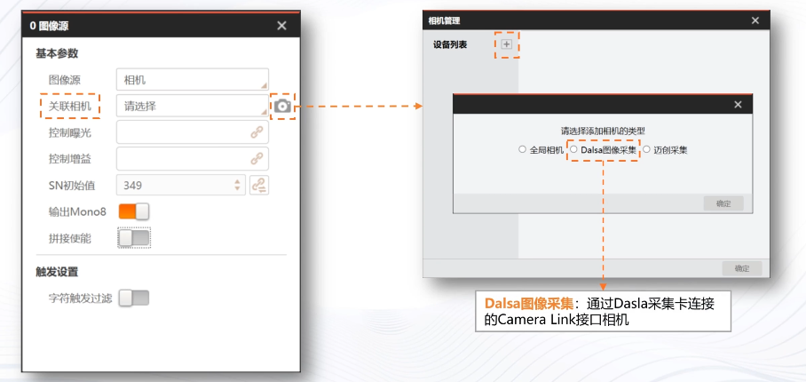
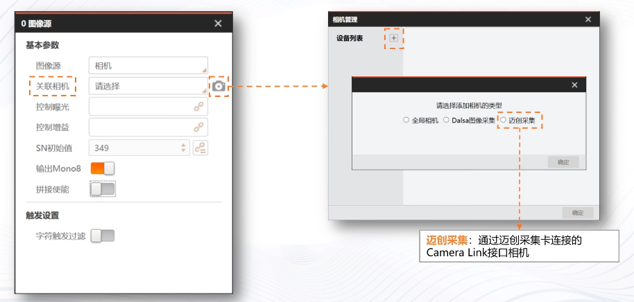
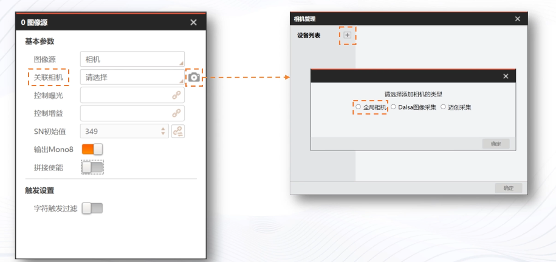
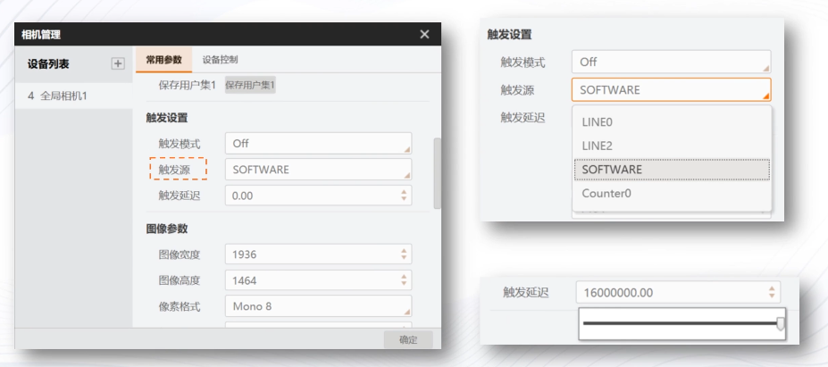
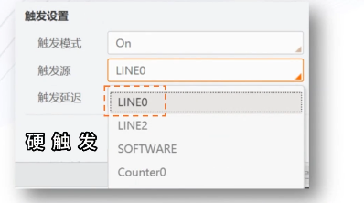
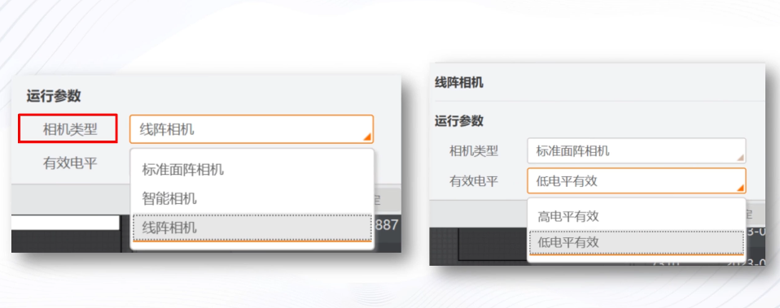

# 相机取图及参数设置

import VideoPlayer from '@site/videoPlayer.js'

<VideoPlayer src="https://xian-vforum.oss-cn-hangzhou.aliyuncs.com/2023-10-10_lecnMST09y_VM%E4%BD%BF%E7%94%A8%E6%95%99%E7%A8%8B%E7%AC%AC%E4%BA%8C%E9%9B%86_x264.mp4"/>

## 相机取图及参数设置

## 1. 关联相机-相机管理界面

除了以上两类外,第三方相机都可以通过全局相机进行连接

## 2. 相机参数设置

1. 相机连接

2. 跨网段IP,枚举

3. 图像缓存数量

4. 实时取流,断线重连

只有支持组播的相机才可以实时取流

5. 触发设置

6. 触发源

LINE0 可以保护电路

LINE2 可配置输入输出,但不能起到保护作用

SOFTWARE 软触发 SDK调用 单次运行可触发一次相机取图 连续运行可连续预览图像

COUNT0 计数器触发 相机接受多次硬件触发信号后才进行一次外触发

7. 图像参数,增益,Gamma使能

停止预览时设置相机的常用参数,推荐在MVSZ中设置好参数,在同步到VM中使用

8. 运行参数

会自动判断,有误手动修正

9. 控制曝光,控制增益

