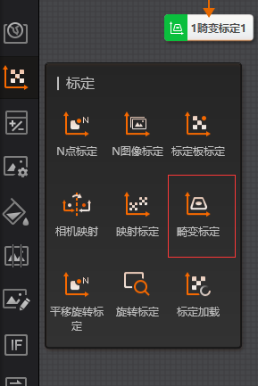
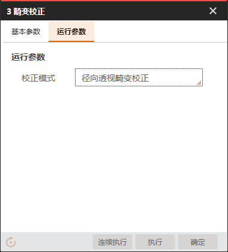
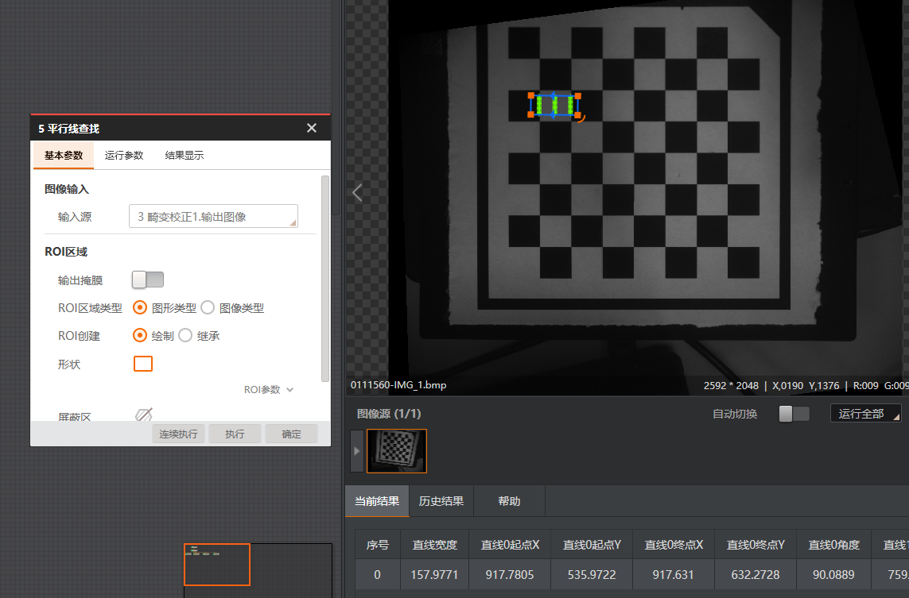
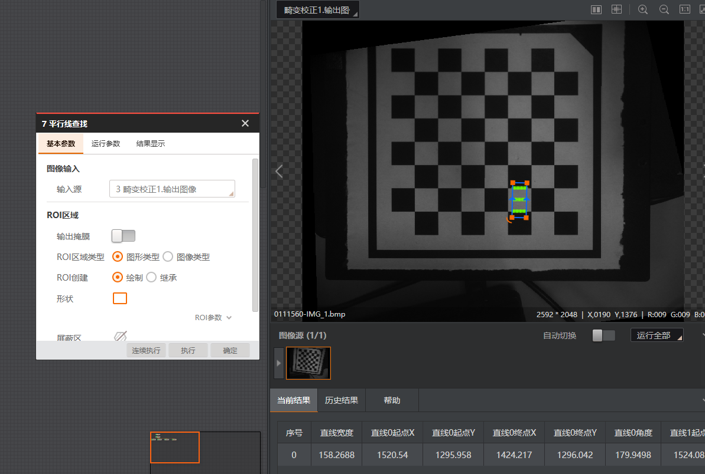
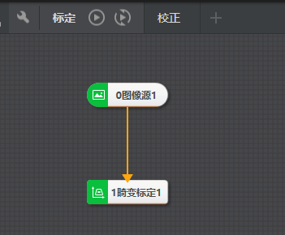
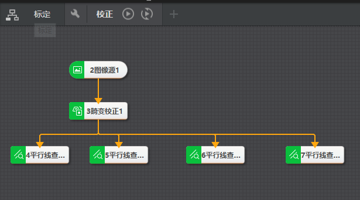

# 畸变标定和畸变校正的使用

import VideoPlayer from '@site/videoPlayer.js'

<VideoPlayer src="https://www.hikrobotics.com/cn2/source/support/video/%E7%95%B8%E5%8F%98%E6%A0%87%E5%AE%9A%E7%95%B8%E5%8F%98%E7%9F%AB%E6%AD%A3.mp4"/>

## 畸变标定和畸变校正

### 1. 功能和分类

### 2. 畸变标定

1. 添加图像源

加载带有畸变的标定板图像

标定时标定板图像需尽量占满视野.

2. 添加畸变标定

用于生成畸变标定文件

    1. 运行参数

    - 畸变类型: 此时标定板图像同时包含径向和透视,因此选择径向透视畸变.

    - 标定板类型:棋盘格标定板

    - 校正中心点:

        1. 透视畸变: 使用默认校正中心点即可,不需自行设置,默认坐标为(0,0)

        2. 径向,径向透视畸变: 校正中心点设置为图像中心时,校正效果最好.
    
        图像大小为2596*2048,设置校正中心点为(1298,1024)

        
    
    点击执行,结果显示提取的角点.标定状态和标定误差.

    - 中值滤波:使用默认值

    2. 生成标定文件

    点击生成标定文件,即可将文件保存在自定义路径.

    

    3. 基本参数

    更新文件打开,新一轮标定后会将结果更新到原文件中

    

### 3. 畸变校正

将流程命名为标定,添加新流程,命名为校正

1. 添加图像源

2. 添加畸变校正

3. 基本参数

标定文件路径选择畸变标定生成的标定文件

4. 运行参数

校正模式选择径向透视畸变

5. 执行

可以看到,相对于原图,已完成畸变校正.

为了验证校正效果,检查图像四角棋盘格宽度是否一致

6. 添加平行线查找

使用平行线查找测量棋盘格Y方向宽度

ROI区域绘制

选择图像左上角黑白格框选测量宽度

7. 添加平行线查找测量X方向宽度

8. 再添加两个平行线查找测量右下角棋盘格XY方向宽度

查看测量结果,左上角与右下角方格宽度相差1个像素内.
说明畸变校正效果良好.

### 4. 完整流程

### 5. 注意事项

