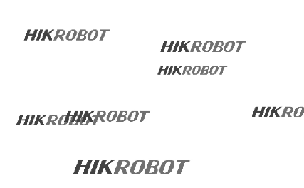
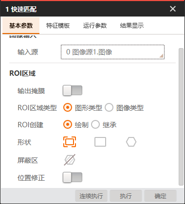
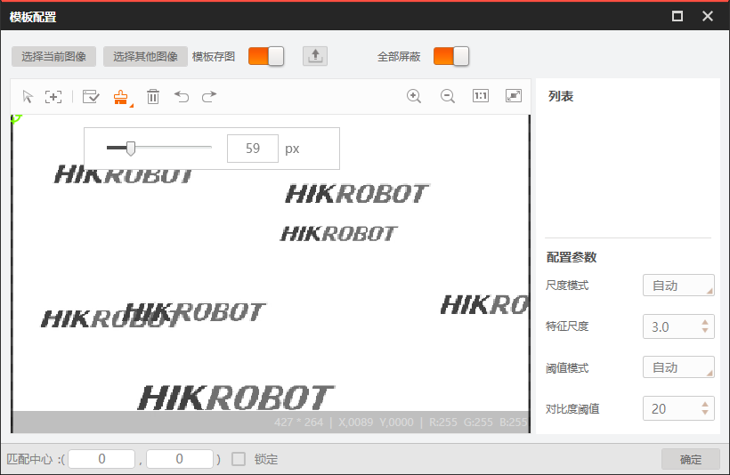
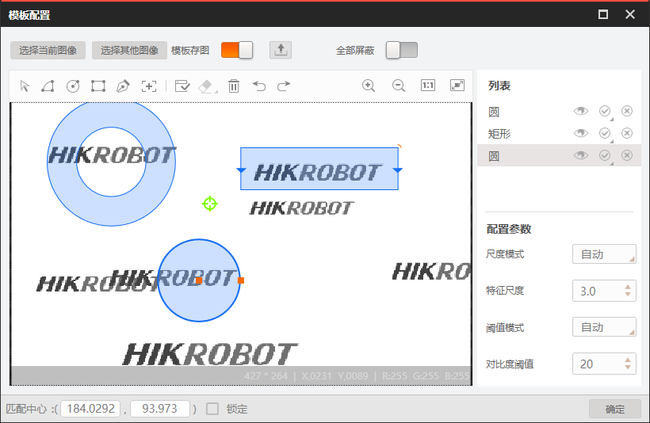
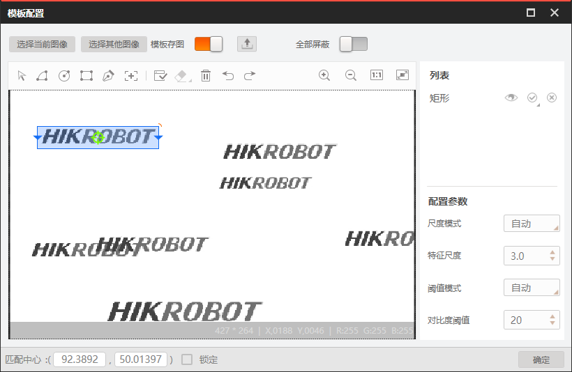
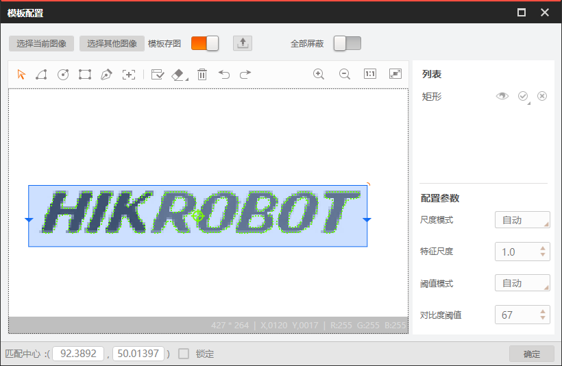
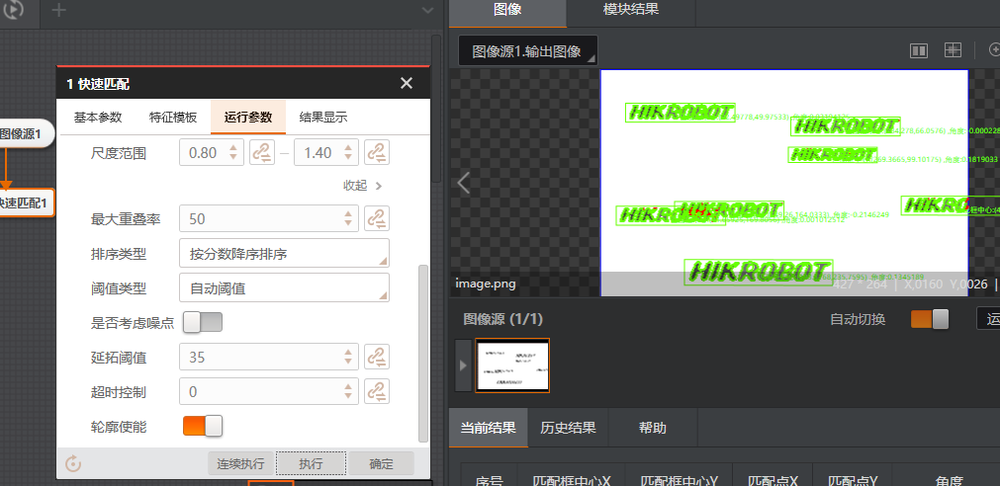

# 快速匹配模块

快速匹配包括基本参数,特征模板,运行参数,结果显示

import VideoPlayer from '@site/videoPlayer.js'

<VideoPlayer src="https://xian-vforum.oss-cn-hangzhou.aliyuncs.com/2022-12-29_dg4yJwSxdg_VM%E5%BF%AB%E9%80%9F%E5%8C%B9%E9%85%8Dx264_1.mp4"/>

## 图像源

## 基本参数

可以修改图像源和模块的ROI区域.

## 特征模版

可以配置管理所有的模版,点击创建可以新增模版,也可以通过载入加载本地的模型

### 建立新模版

点击创建,可以选择当前图像或本地图像进行建模

模版存图按钮用于设置模版保存时是否同步保存模版中的图片

模型工程导出按钮可以将模型导出到本地

全部屏蔽打开时整张图都会被设置为屏蔽区域,此时可以使用画笔工具描绘需要建模的模版特征轮廓.

显示窗体上方为建模工具编辑区域

可以在右侧对掩摸工具进行管理

可以设置掩摸区域是否隐藏,是匹配区域还是掩摸区域

以此图为例,需要匹配多个logo,先用其中一个建模

点击创建模型图标

放大即可看到图像提取的特征点,一般使用默认参数即可.

如建模效果不佳,可将模版配置中尺度和阈值模式的自动改为手动来进行调整.

特征尺度越大,相应的抽取边缘点就越稀疏,但会加快匹配速度,默认范围是1~20,取值为1时最精细

对比度阈值:对比度的大小,主要与特征点和周围背景的灰度值差有关.该值越大被淘汰的特征点越多,默认范围是1~255

将对比度阈值模式改为手动,设置为80,并生成模型,可以看到轮廓点数量少了很多.

点击确定完成建模

## 运行参数

可以配置特征匹配的一些参数,从而更搜索条件,符合条件的才会被搜索到.

### 1. 全部搜索模式
开始后可以对所有已创建的模板进行逐一匹配,输出最优的结果

### 2. 最小匹配分数

匹配分数指特征模版和搜索目标的相似程度,达到该阈值才会被搜索到,范围是0.1-1,最大值表示完全契合,默认为0.5

### 3. 最大匹配个数

默认为1,范围1~1000

### 4. 匹配极性

特征图形到背景的颜色过滤情况,如边界颜色由白到黑或由黑到白,当查找目标的边缘极性和特征模版的极性不一致时,仍要保证目标被查找到,则匹配极性需设置为不考虑极性,如不需要可设置为考虑极性,能够缩短模版查找耗时.

### 5. 角度范围

待匹配目标相对于已创建模版的角度变化范围.

### 6. 尺度范围

待匹配目标相对于已创建模板的一致性尺度变化范围.
默认为1.0-1.0

发现仍有部分未匹配到,将范围设置为0.8到1.4,再次执行

在某些场景下还需要使用高级参数来匹配目标

### 高级参数

1. 最大重叠率

两个被检测目标彼此重合时,两者比例框被允许的最大重叠比例,该值越大则允许两目标重叠的程度就越大.范围0-100

2. 排序类型

将匹配结果按所选排序规则进行排序

3. 阈值类型

选择自动阈值可以根据目标图像自动决定阈值参数自动适应

选择模版阈值则以模版对比度阈值经过内部转换后作为匹配阶段的对比度阈值

手动阈值则是以用户设定的阈值作为查找的阈值参数

4. 是否考虑噪点

开启考虑噪点后,如特征存在毛刺,则相应匹配分数会降低,通常无需开启该按钮

5. 延拓阈值

特征缺失的部分相对于完整的特征的比例

当被查找的目标显示在图像边缘不全时,延拓阈值可以保证图像被找到.如图右侧模版只有一半,此时无法被查找到.只要设置延拓阈值大于35时就可以保证该目标被查找到

6. 超时控制

超时控制规定了搜索时间,当时间超过控制所设置时间就会停止搜索,不返回任何搜索结果,取值范围0~10000,单位ms,0指关闭超时控制功能

7. 轮廓使能

开启轮廓使能后,将在匹配结果中显示特征模版的轮廓，不勾选则不显示特征点,只显示匹配框,可以减少工具耗时

## 结果显示

1. 结果判断

可显示对结果的判断,当结果符合设置的条件时,模块才会显示为OK.

2. 图像显示

自定义模块渲染结果

3. 文本显示

显示用于设置文本的内容,颜色,字号和位置等.

