# Group模块

import VideoPlayer from '@site/videoPlayer.js'

<VideoPlayer src="https://www.hikrobotics.com/cn2/source/support/video/Group%E6%A8%A1%E5%9D%97%E7%9A%84%E4%BD%BF%E7%94%A8%E6%95%99%E7%A8%8B.mp4"/>

## Group模块的使用

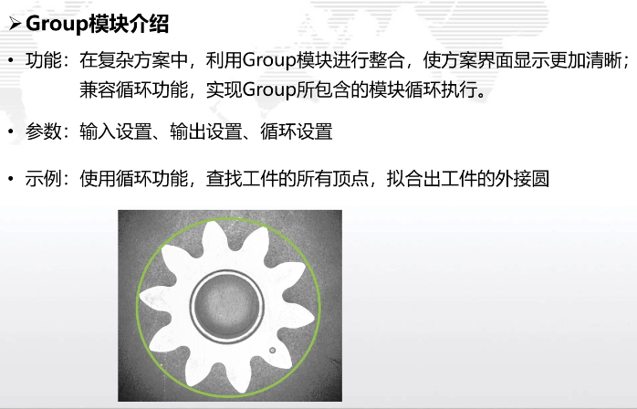

### 1. 添加图像源，导入图片

### 2. 添加快速匹配

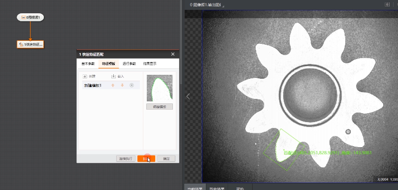

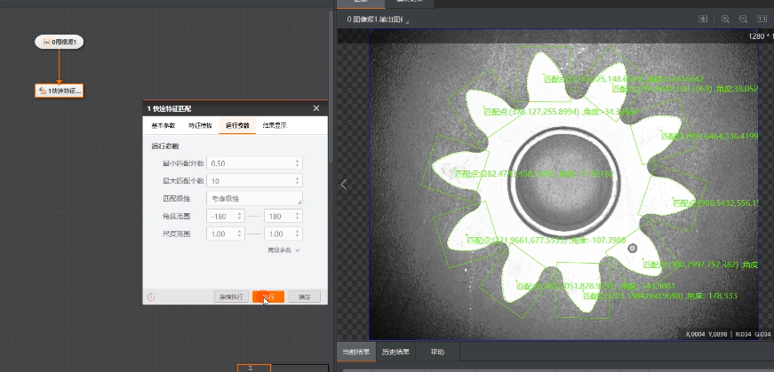

对匹配框区域进行顶点检测
并循环10次(匹配框个数
从而检测出所有顶点)。

### 3. 添加Group工具

拖一个Group模块

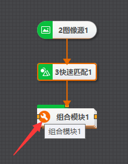

点击设置

1. 输入设置

添加图像源输入数据

添加快速匹配的匹配框

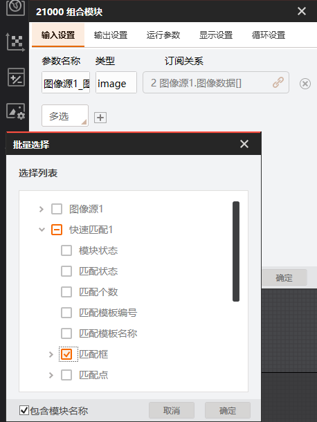

### 4. 双击Group工具块进入

1. 添加顶点检测

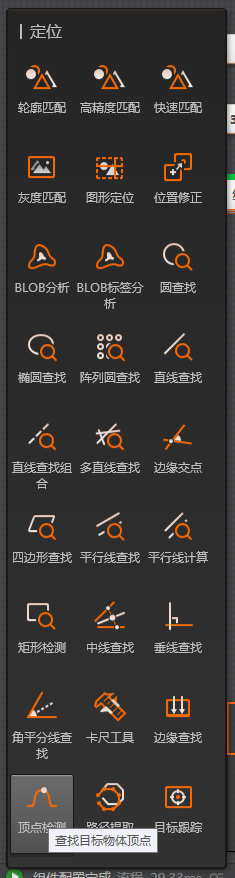

用于定位匹配框中的顶点

基本参数设置

图像输入源选择Group的图像输入源

ROI区域继承方式

1. ROI创建选择继承

2. 继承方式选择按区域

3. 区域选择Group的快速匹配的匹配框
光标需放在[]中选择循环索引,循环索引用于实现依次检测10个匹配框的顶点,若不订阅,模块会循环检测同一个匹配框

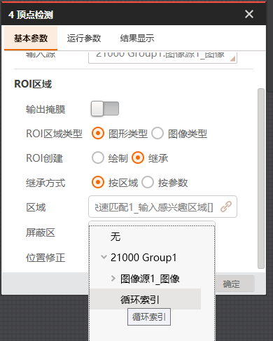

### 5. 执行顶点检测

可以看到绿色是它的边缘点.为方便查看顶点,将边缘点设置为不可见

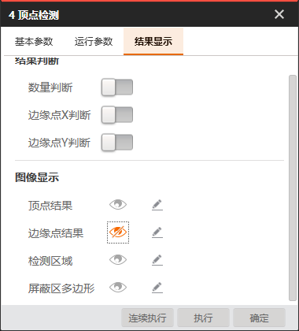

为显示方便,将OK设为红色,NG设为绿色

可以看到检测到的顶点

### 6. 添加点集

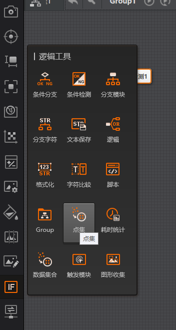

拖出一个点集模块，用于组合检测出的顶点
1. 基本参数
点输入选择顶点检测的顶点

打开循环使能

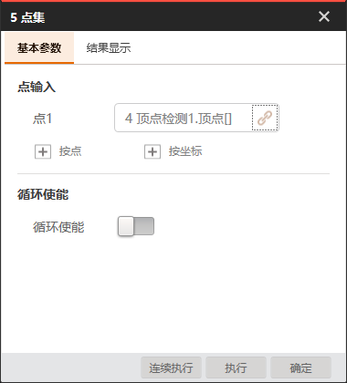

点击执行

此时Group内部的方案就完成了

### 7. Group设置

回到上一层,点击Group工具的设置图标,

1. 输出设置

将点集的点结果输出

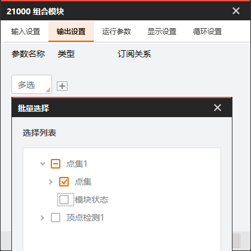

2. 循环设置

循环使能打开,开始值设为0,循环结束值设为快速匹配的匹配个数

3. 显示设置

添加订阅到Group内部的顶点检测

### 8. 添加圆拟合工具

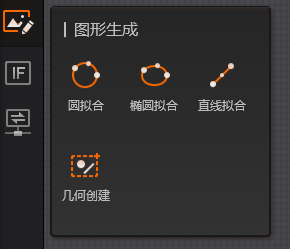

圆拟合的点设置为Group工具输出的点集

### 9. 运行流程

