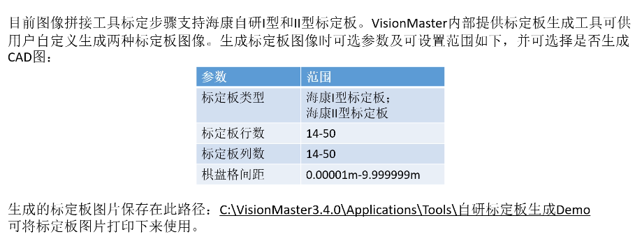
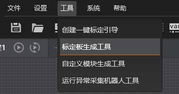
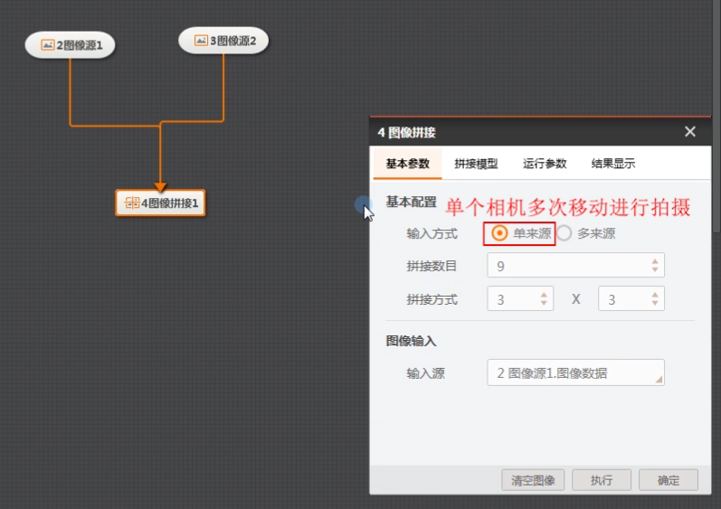
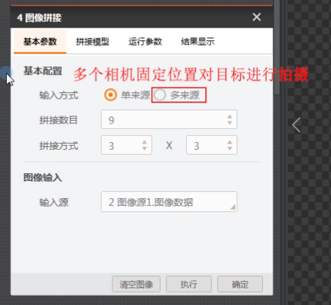
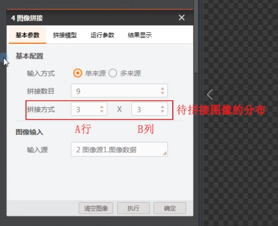
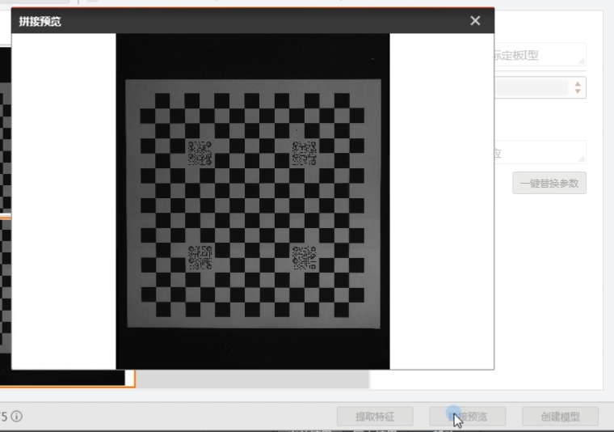
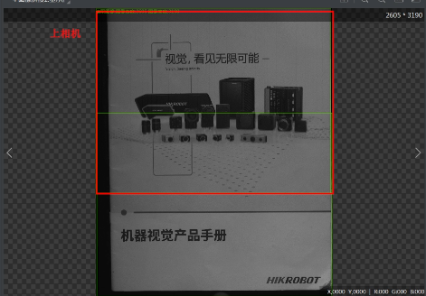

# 图像拼接

由于硬件或安装环境限制，单个相机视野无法覆盖整个视野
但实际应用需要全视野图像时，可以拍摄物体的多个部分拼
接成一张整图。VisionMaster提供图像拼接工具对图像进行拼
接。

import VideoPlayer from '@site/videoPlayer.js'

<VideoPlayer src="https://www.hikrobotics.com/cn2/source/vision/video/2021/6/25/20210625074155440.mp4"/>

## 图像拼接模块操作步骤

## 标定板

## 标定工具

按实际需求生成标定板图片即可.

## VM中创建全局相机

在实际应用中，一般需要对相机实时数据进行拼接。因此需要创建全局相机以便图像模块订阅

## 图像拼接标定建模步骤

## 注意事项

单相机
- 多位置拍摄需要保持每个周期内各点位置一致
多相机
- 需要保持各相机相对位置不变
- 各相机分辨率保持一致
- 各相机视野保持一致
标定时需要注意如下情况，否则会导致图像提取特征失败
- 图像需要保证清晰度
- 标定板类型选择需要保持与标定图像使用的一致

## 图像拼接效果

