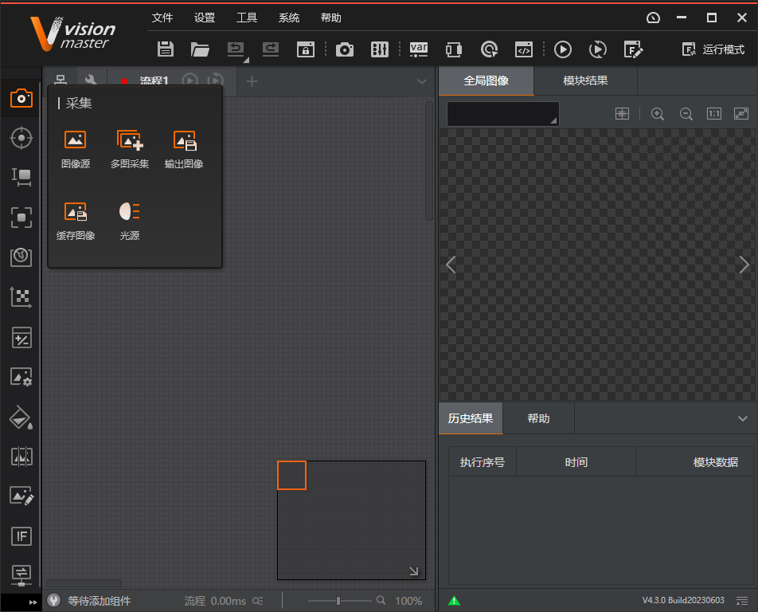
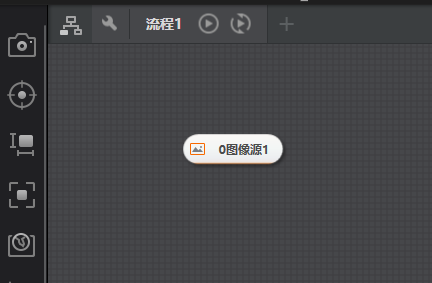
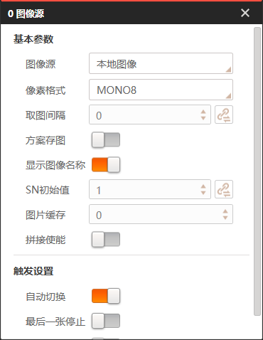
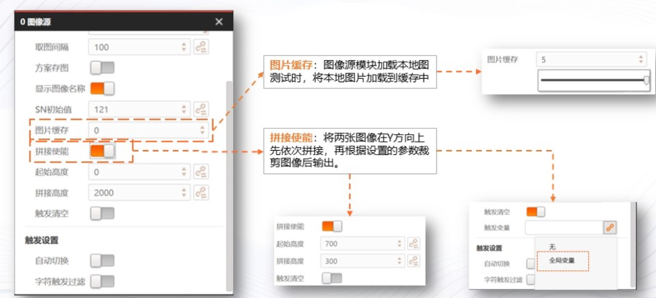
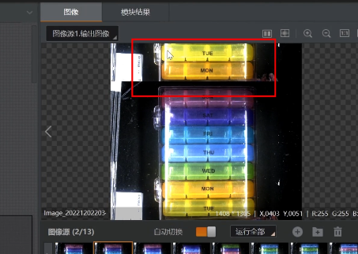

# 本地图像导入及参数设置

import VideoPlayer from '@site/videoPlayer.js'

<VideoPlayer src="https://xian-vforum.oss-cn-hangzhou.aliyuncs.com/2023-09-15_lhNLtnVZC4_%E6%9C%AC%E5%9C%B0%E5%9B%BE%E5%83%8F%E5%AF%BC%E5%85%A52.0%E5%A3%B0%E8%B0%83%E6%88%90%E7%89%87%E7%89%88%E6%9C%AC_x264.mp4"/>

## 本地图像导入及参数设置

## 本地图像导入

1. 在工具箱中找到采集

2. 拖取图像源模块到流程编辑区域

3. 双击图像源,选择图像源为本地图像

4. 添加图像,添加图像文件夹,清空图像

## 参数设置

### 1. 像素格式,取图间隔

:::tip
1. VM只支持读取和导入它所支持的图像格式.
2. 现场方案运行时,需要固定时间去进行取流,取图间隔的设置范围在0-1000毫秒,大部分情况下,取图间隔都设置为0.
:::

### 2. 方案存图,SN初始值

:::tip
1. 方案存图作用:下次打开该方案文件时,图像源已有图像无需重新导入.
2. SN初始值:相当于计数器的功能,在方案运行时,需要特别的计数以及查看本次输出的结果是哪张图像时使用的.一般不做额外设置
:::

### 3. 图片缓存,拼接使能

:::tip
1. 图片缓存:减少直接从磁盘读取图片的耗时,主要用于从本地图去测试方案的耗时情况和耗时波动情况
2. 拼接使能:单张图片无法将其完全展示,因此需要导入被测物的多张图片,将图像拼接裁剪后进行算法处理.与拼接使能搭配使用的是触发清空功能,其启用后当订阅的触发变量非0,则会清空上一张图像的缓存,该触发参数只能使用全局变量
:::

#### 操作展示:拼接使能
1. 双击图像源,打开拼接使能按钮,起始高度对应拼接图像Y方向上的起始位置及其Y方向上的起点

2. 移动鼠标,设置起始高度为743

3. 裁剪最后两行进行拼接,拼接高度是决定裁剪图像的图像高度,用1024-743=281.

4. 运行方案

第一张图像上方没有图像或图像缓存,所以为黑色.

继续运行第二张图像,两张图像成功拼接在了一起.

5. 点击图像源,打开触发清空

触发变量为空,此时仍能正常拼接

设置触发变量为非零 1

这时触发清空后,会发现其清空了上一张图像的缓存.

### 4. 触发清空,字符触发过滤

输入字符为"空",也会触发流程.

## 总结

- 采集模块-图像源-本地图像导入
- 基本参数
1. 像素格式的选择
2. 取图间隔的设置
3. 方案存图: 是否需要开启/存储路径
4. SN初始值到底是什么
5. 如何使用拼接使能
- 触发设置
1. 触发清空使能
2. 字符触发过滤

