# OK/NG计数方案搭建

import VideoPlayer from '@site/videoPlayer.js'

<VideoPlayer src="https://www.hikrobotics.com/cn2/source/support/video/OK%20NG%E8%AE%A1%E6%95%B0%E6%96%B9%E6%A1%88%E6%90%AD%E5%BB%BA%E6%95%99%E7%A8%8B.mp4"/>

## OKNG计数方案

## 1. 添加图像源

## 2. 添加圆弧边缘缺陷检测

1. 基本参数

自行绘制ROI,在图像上拖动小圆,圈住被测物

2. 运行参数

    1. 边缘类型:选择最强
    2. 边缘极性:由黑到白

    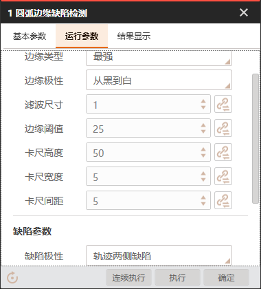

    3. 缺陷距离阈值: 10

    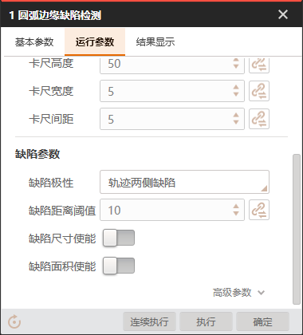

3. 结果显示

为方便查看,文本显示内容设置为:检测结果:{}

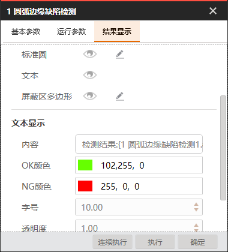

光标移动到{}中间,选择模块状态

执行结果

## 3. 添加条件检查工具

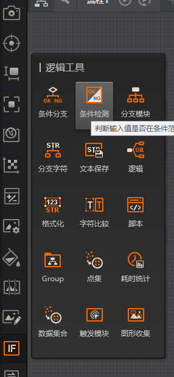

点击条件检测工具

1. 基本参数

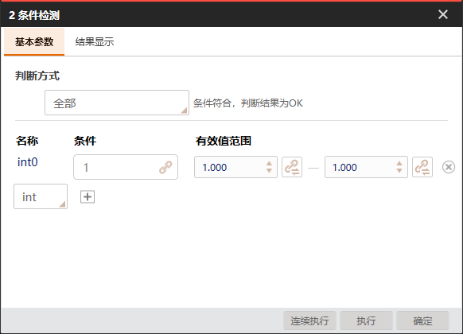

判断方式设置为全部

添加变量

条件设为1,有效值设为1-1

点击执行

## 4. 添加变量计算

重命名为计数

1. 基本参数

    1. 添加两个变量用于统计检测数和OK数

    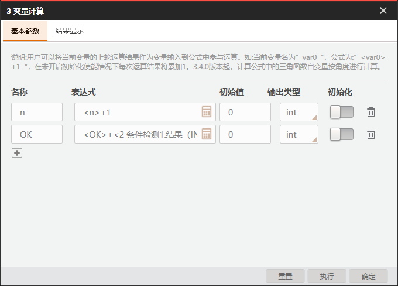

    2. 在表达式项打开计算器图标,分别设置n,OK
    点击链接选择计数的n变量,点击+,点击1
    
    

    点击计数的OK+条件检测结果1的结果(INT)

    

    3. 完成后保存执行,左上方会显示n和ok值

    

## 5. 计算合格率

1. 再添加一个变量计算工具

2. 基本参数

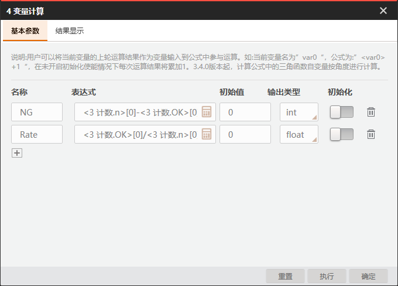

增加NG和Rate变量，NG表达式通过链接选择计数的n-计数的OK,Rate表达式通过链接选择计数的OK/计数的n*100

点击执行,查看到NG数和良率

## 6. 界面设计

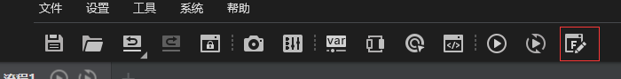

打开后编辑界面

1. 拖动图像显示区为如下范围大小

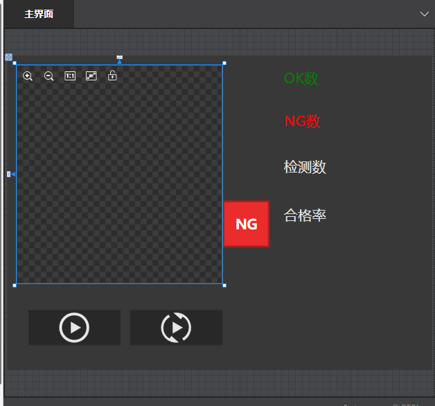

2. 配置图像数据源

3. 配置图形配置

4. 拖动OKNG位置

5. 配置OKNG数据源

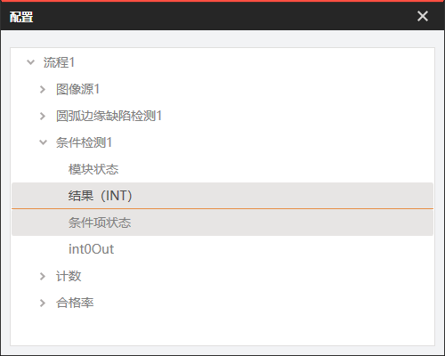

6. 添加OK数,NG数,检测数,合格率的文本框

字体大小均设置为24,数据类型设置为int,选择对应数据源,合格率类型设置为float

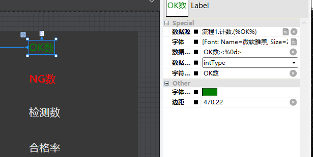

## 7. 预览界面
点击预览

点击运行按钮

## 8. 重置计数

添加Btn按钮,触发命令类型设置为重置

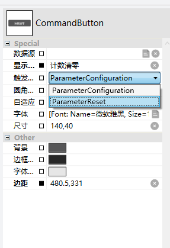

数据源设置为所有变量计算

点击预览,运行,点击计数清零

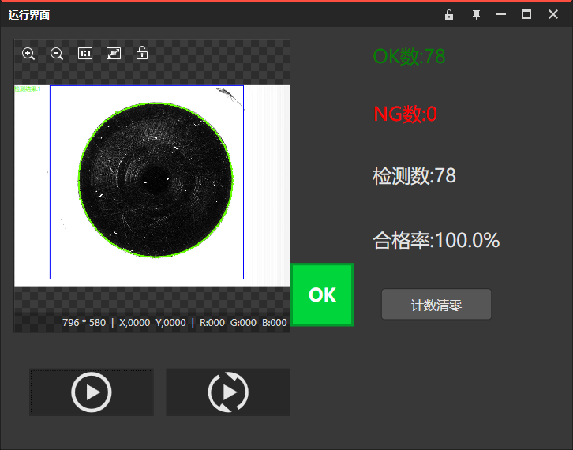

点击计数清零后,下次运行重新开始计数

