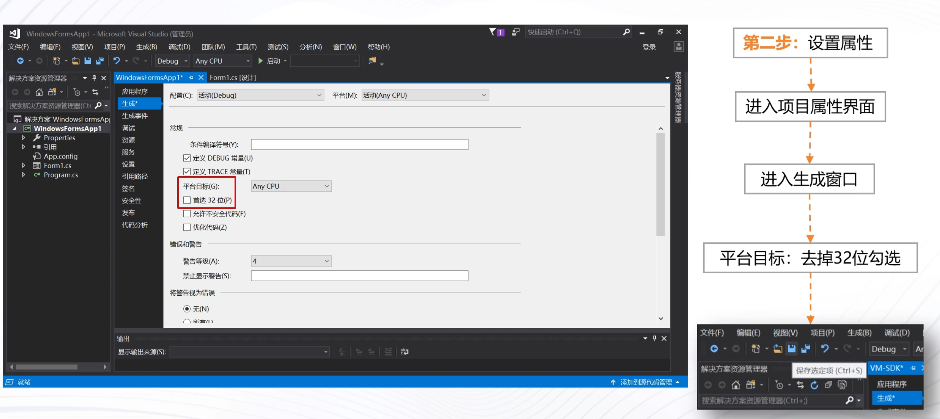
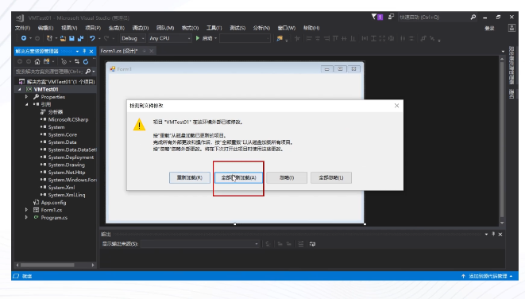
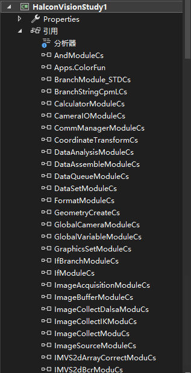
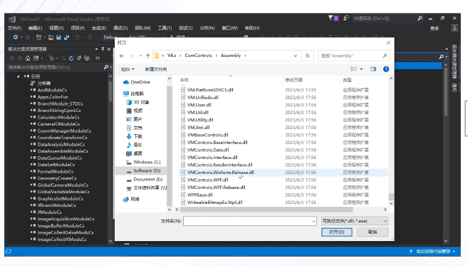
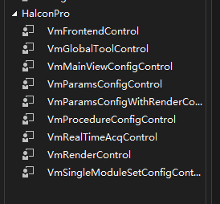
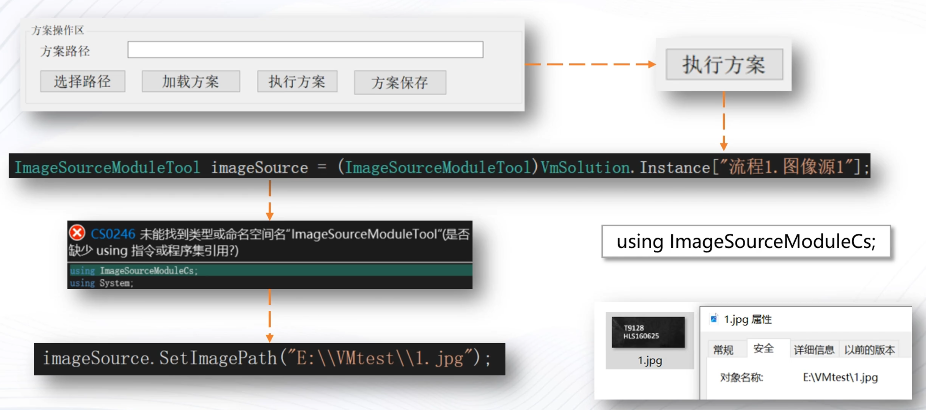
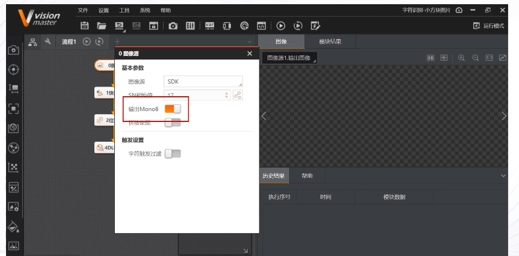

# SDK取图

import VideoPlayer from '@site/videoPlayer.js'

<VideoPlayer src="https://xian-vforum.oss-cn-hangzhou.aliyuncs.com/2023-11-14_G9KlDNohKd_VM%E4%BD%BF%E7%94%A8%E6%95%99%E7%A8%8B-SDK%E5%8F%96%E5%9B%BE-%E6%88%90%E7%89%87_x264.mp4"/>

## SDK取图

## 环境配置-创建项目

1. 创建C#Winform .NetFramework的项目

2. 右键项目,打开属性,生成界面,去掉32位勾选.如果项目启动报错,可以首先检查是否去掉32位勾选

3. 点击全部加载

4. 查看引用已全部加载

5. 工具箱右键选择项,浏览,添加

6. 工具箱搜索VM,即可打开相关控件

## 界面搭建

流程显示区使用了VmProcedureConfigControl控件

图片显示区使用VmRenderControl控件

## 采集模块-图像源-SDK取图

有两种方法输入图像数据,第一种是使用SetImageData为图像源输入图像数据,该方法只是单次有效.第二种SetImagePath可以从本地路径获取图像

如果所取图像为灰度图,需要打开Mono8使能,后续模块需要订阅图像源为灰度图.

