# VM基础操作

import VideoPlayer from '@site/videoPlayer.js'

<VideoPlayer src="https://xian-vforum.oss-cn-hangzhou.aliyuncs.com/2022-07-04_UFb2STEgKL_VM%E5%9F%BA%E7%A1%80%E6%93%8D%E4%BD%9C%E6%BC%94%E7%A4%BA%E8%A7%86%E9%A2%91_x264.mp4"/>

## VM示例方案

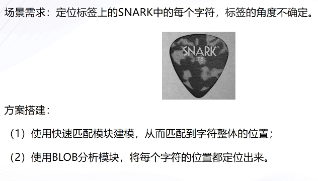

## 1. 工具拖拽及使用方式

分别从采集和定位栏里拖拽图像源,快速匹配,Blob分析工具

## 2. 模块连线

依次连线

## 3.如何订阅

点击快速匹配,可以看到输入源已订阅了图像1的图像,Blob分析类似

## 4. 方案操作及全局触发

1. 点击快速匹配,创建特征模版,框选文字,运行参数角度范围设为-180到180

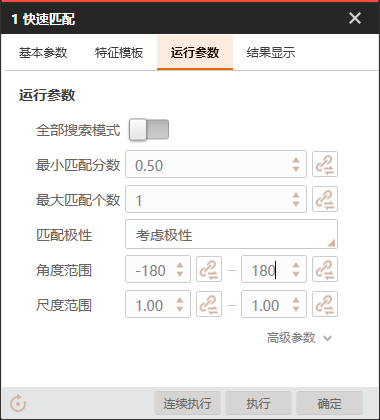

2. 执行

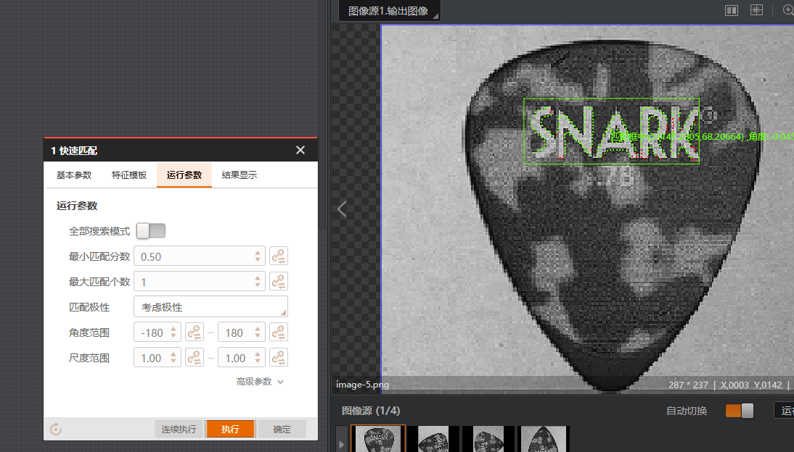

3. Blob分析基本参数ROI创建选择继承,按矩形区域,区域链接选择快速匹配的匹配框,运行参数设置极性设置为亮于背景,低阈值设置为150.这样就可以将ROI区域内灰度值大于150的字符给定位到.

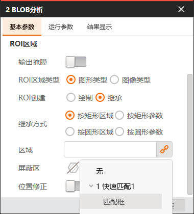

4. 点击执行,可以看到每个字符都被定位到.

5. 添加字符识别模块

运行参数启用字符过滤,识别字符数为5,点击5次大写字母

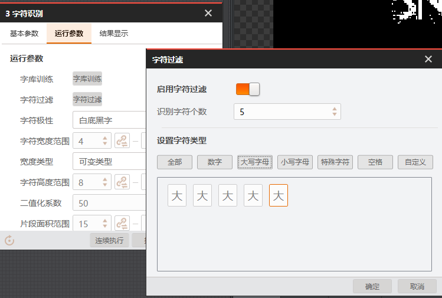

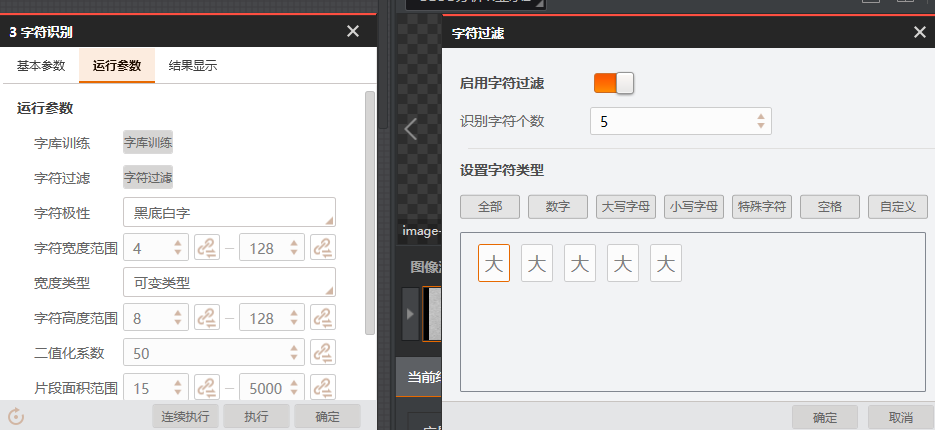

6. 执行工具

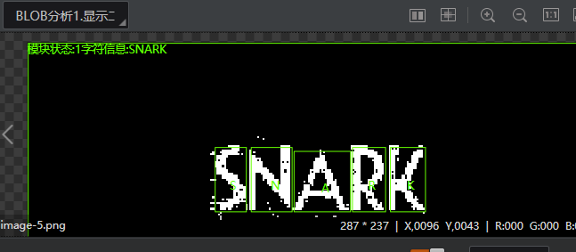

7. 添加格式化模块

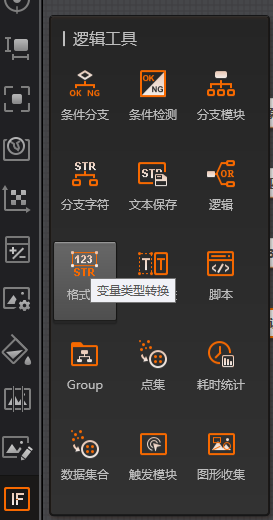

订阅字符信息

8. 添加发送数据模块

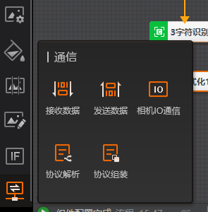

9. 添加TCP服务器

将设备开启

10. 设置全局触发

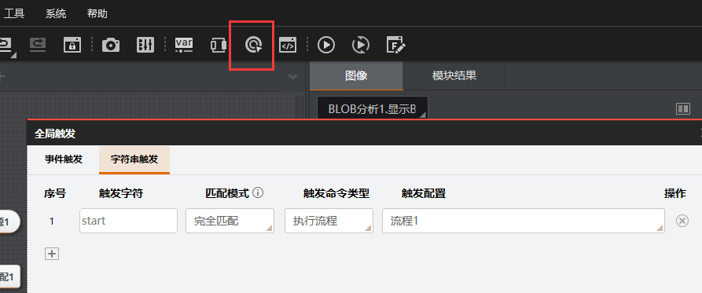

设置触发为start

11. 打开发送数据工具,配置参数

选择通信设置,TCP服务端
发送数据选择格式化的格式化信息

12. 配置网络调试助手

选择TCP客户端,填入在VM中设置好的服务器地址和端口,连接

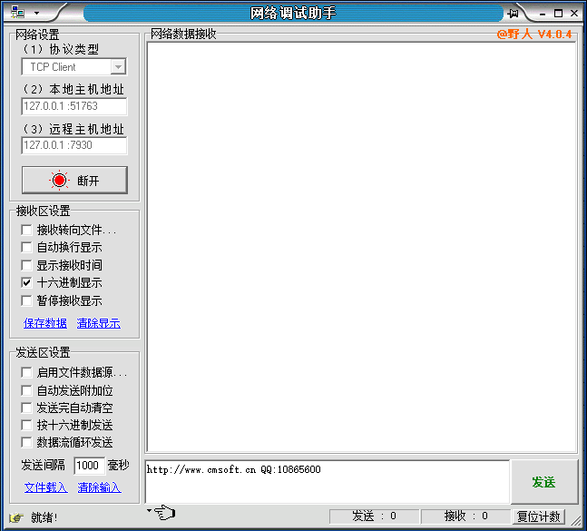

在发送窗口输入start,点击发送

可以看到整个流程都被执行一遍,字符识别后也发送到了客户端.

## 5.方案保存及加载

点击保存图标,将方案另存到本地

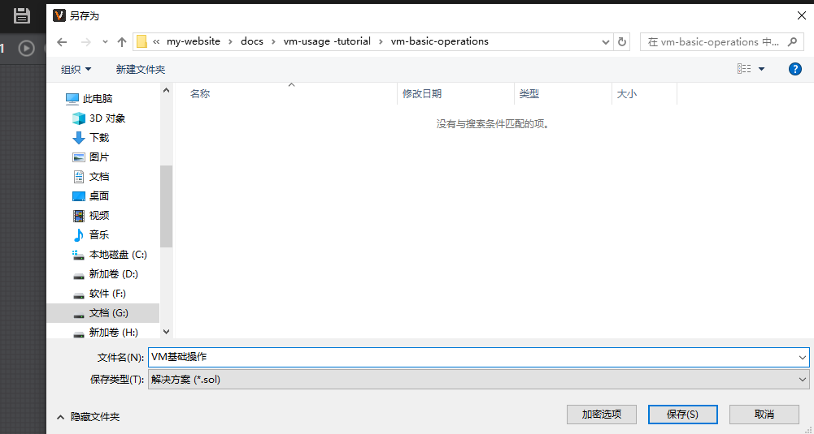

点击菜单栏文件选项,打开方案,加载方案到VM中.

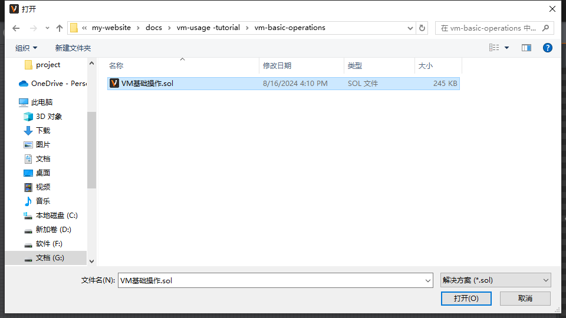

## 6.相机触发

1. 添加相机设备

在菜单栏打开相机管理,选择全局相机

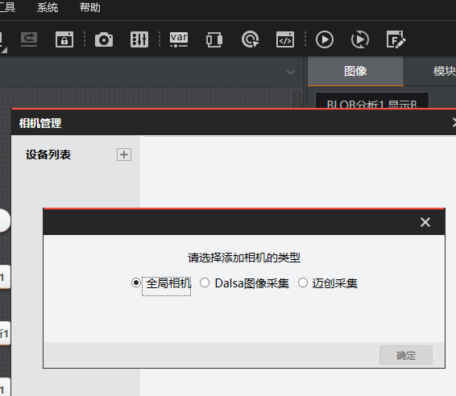

2. 选择需要连接的相机

3. 设置触发源为软触发

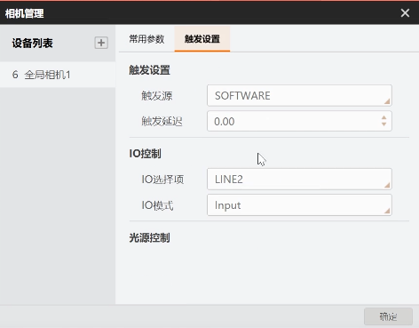

4. 更改图像源

在图像源模块中设置图像源为相机

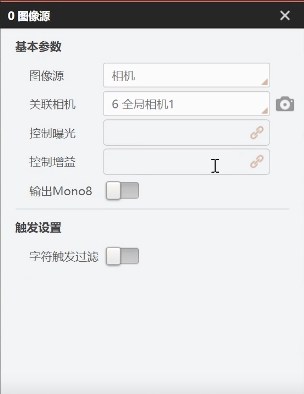

设置关联相机为刚设置好的全局相机

5. VM中的图像由刚刚的标签变为了相机实际拍摄的图像

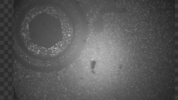

