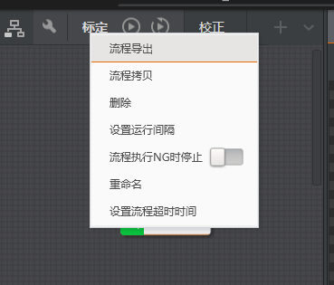
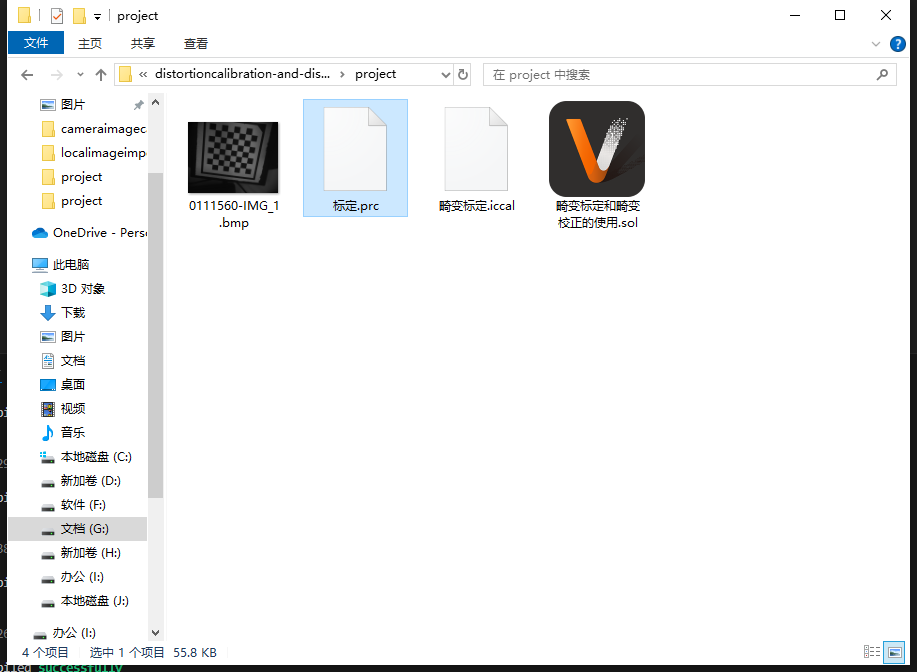
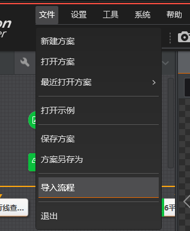
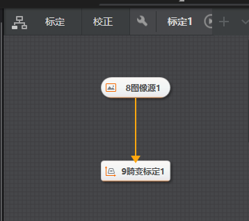
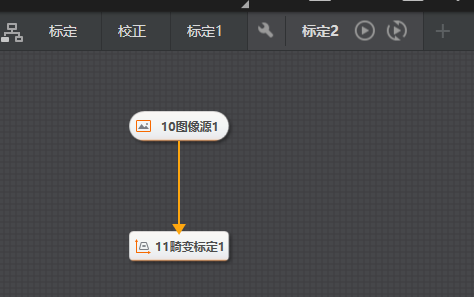
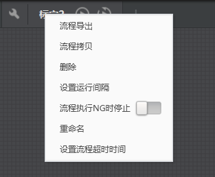
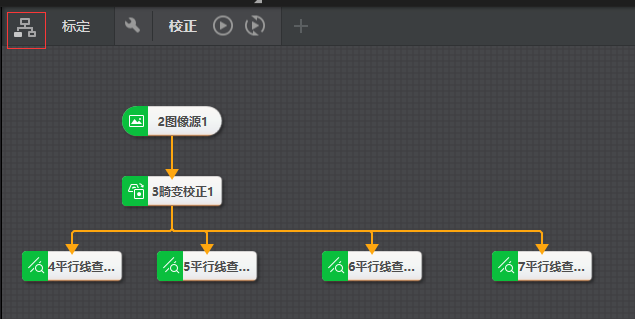

# VM流程操作

import VideoPlayer from '@site/videoPlayer.js'

<VideoPlayer src="https://xian-vforum.oss-cn-hangzhou.aliyuncs.com/2022-06-15_xwrzeOjJKW_VM%E6%B5%81%E7%A8%8B%E6%93%8D%E4%BD%9C%E8%A7%86%E9%A2%91_x264.mp4"/>

## 流程导出

流程会以.prc格式保存到本地

## 流程导入

可以将流程导入方案

## 流程拷贝

## 流程删除

对应流程将从方案中删除

## 设置运行间隔

连续运行流程前后两次的时间间隔,默认为100ms.则在执行完流程内所有模块后,需要等待100ms再做一次执行

## 流程NG时停止

点击连续执行,图像区的自动切换打开,连续执行流程时如果有NG,则停止执行

## 重命名

可以更改流程的名字

## 全流程配置

在流程栏最左侧,点击全流程按钮,整个流程变为模块一样的状态,默认流程之间独立执行

有单次执行,连续执行,流程参数设置按钮

流程参数设置按钮,进入后可对当前流程的输入,输出以及显示进行相关设置

1. 输入设置

可选择前序流程输出设置中配置的参数发送给当前流程,供当前流程的模块工具进行订阅

2. 输出设置

可设置当前流程输出哪些参数

3. 显示设置

可设置当前流程中的哪些数据在图像显示窗口呈现

4. 连线

全流程视图中,流程之间也可以像模块一样连接起来

表明方案中校正需要标定执行后才执行

关闭流程按钮,可禁用该流程,执行时不会触发该流程

