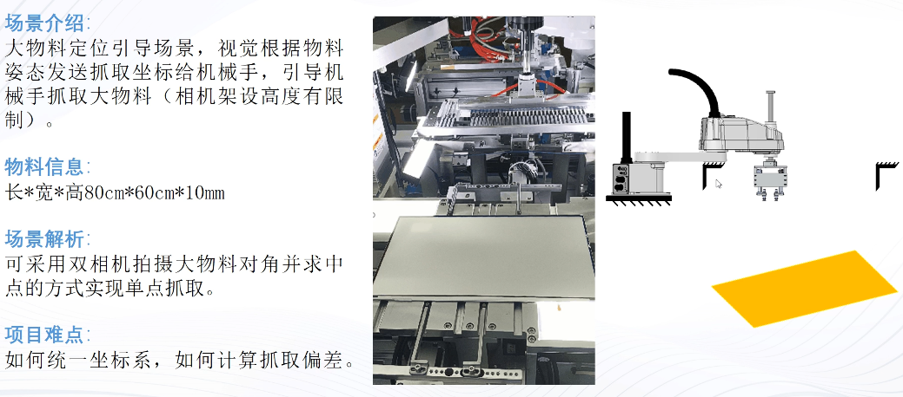
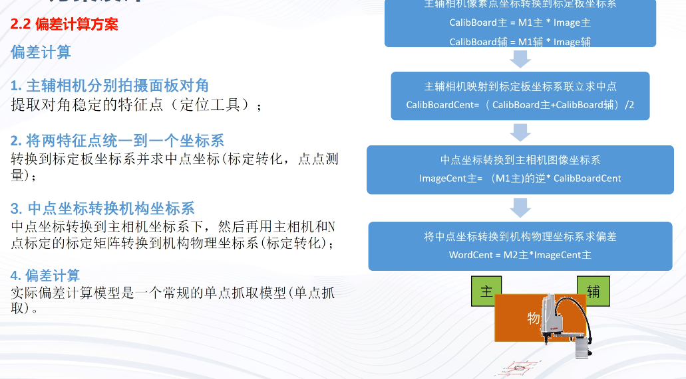
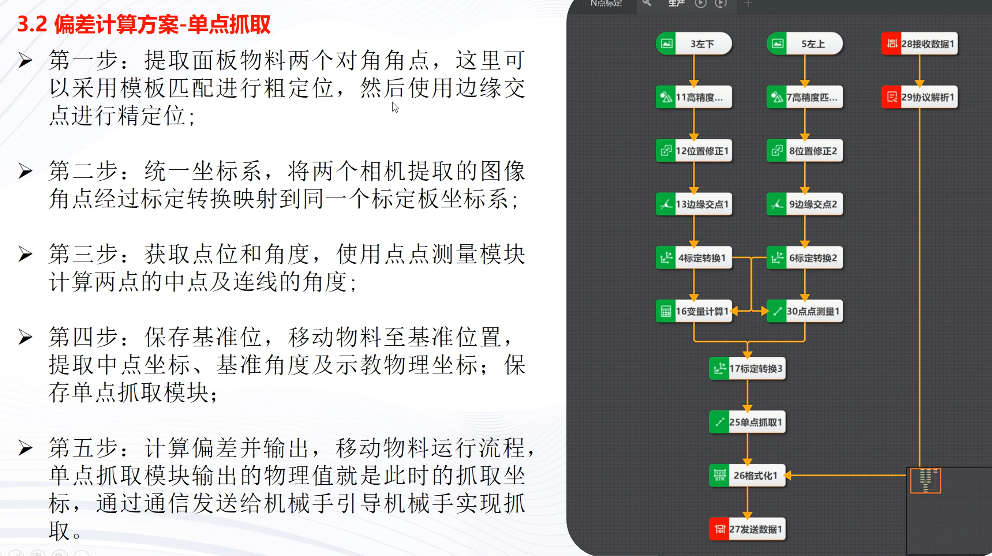
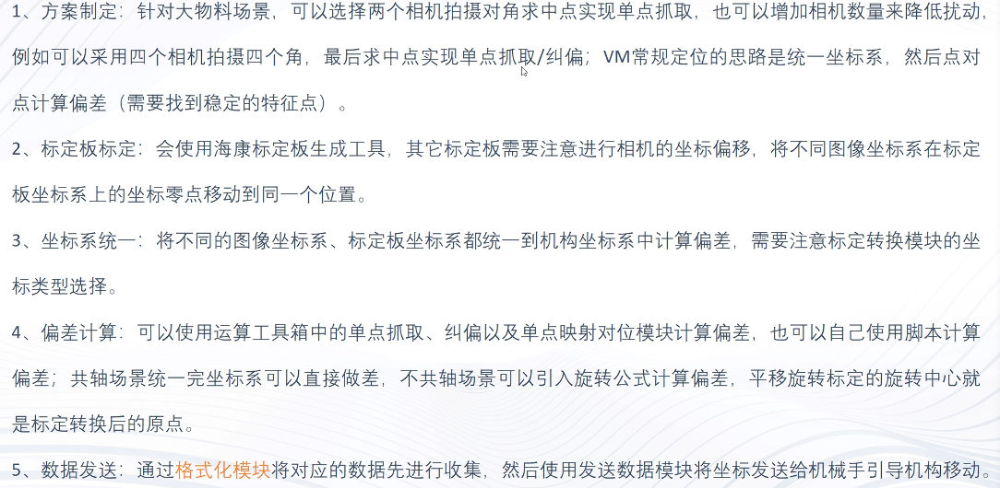

# 双相机定位引导应用案例

import VideoPlayer from '@site/videoPlayer.js'

<VideoPlayer src="https://xian-vforum.oss-cn-hangzhou.aliyuncs.com/2022-07-19_qXKc5ImxUm_%E5%8F%8C%E7%9B%B8%E6%9C%BA%E5%AE%9A%E4%BD%8D%E5%BC%95%E5%AF%BC%E5%BA%94%E7%94%A8%E6%A1%88%E4%BE%8B.mp4"/>

## 场景介绍

## 方案设计

### 偏差计算方案

## 方案展示

### 标定方案-上下相机分别进行标定板标定

### 标定方案-主相机与机构做N点标定

### 偏差计算方案-单点抓取

### 偏差计算方案-单点纠偏

## 知识点总结

