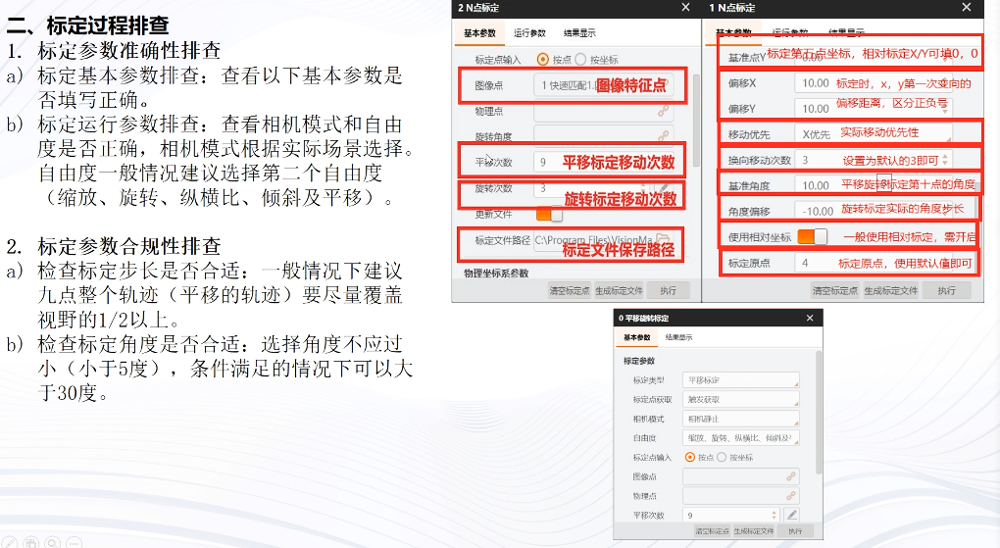
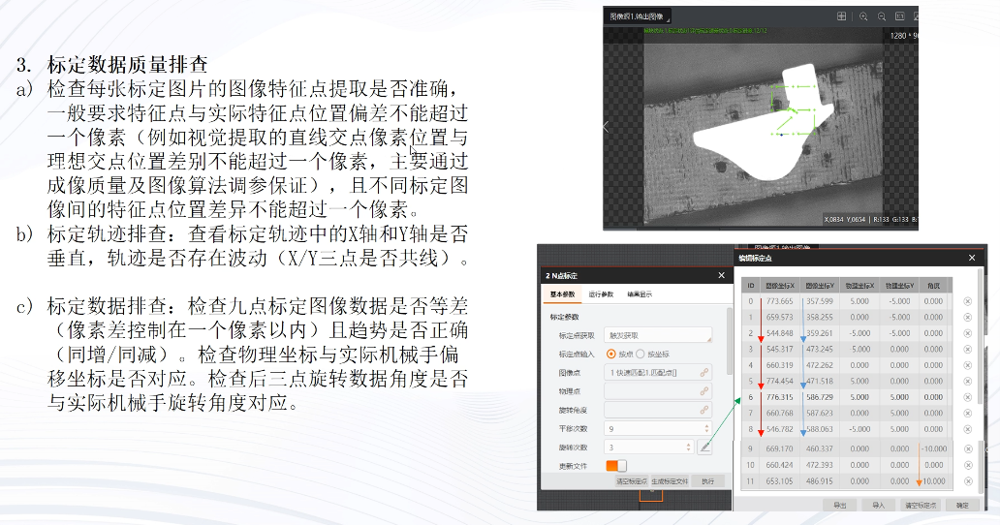
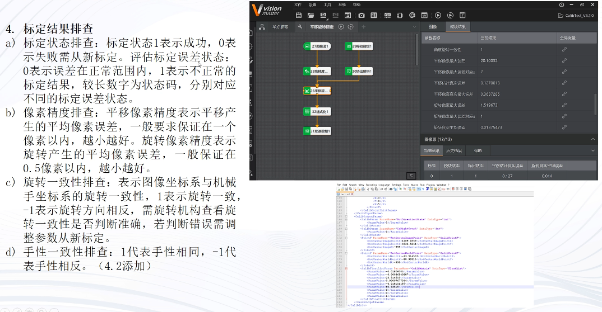
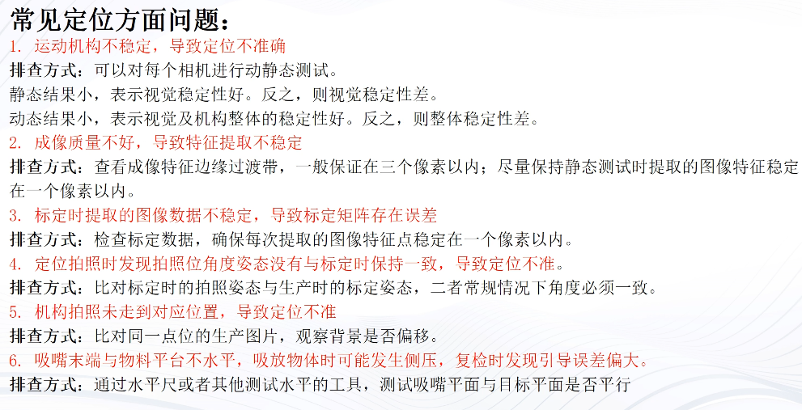

# 定位项目误差分析及精度提高

import VideoPlayer from '@site/videoPlayer.js'

<VideoPlayer src="https://xian-vforum.oss-cn-hangzhou.aliyuncs.com/2022-07-19_O6bN5GiSwW_%E5%AE%9A%E4%BD%8D%E9%A1%B9%E7%9B%AE%E8%AF%AF%E5%B7%AE%E5%88%86%E6%9E%90%E5%8F%8A%E7%B2%BE%E5%BA%A6%E6%8F%90%E9%AB%98.mp4"/>

## 定位问题排查步骤

## 机构及成像排查

## 标定过程排查

## 标定数据质量排查

## 标定结果排查

## 示教过程排查

# 注意事项总结

