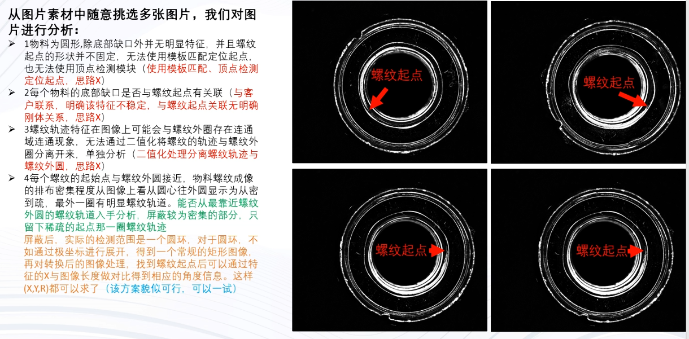
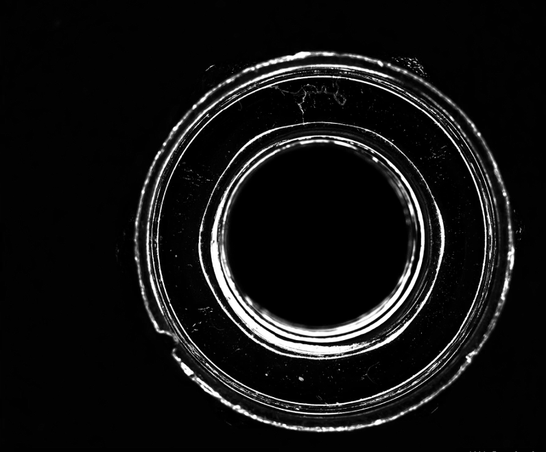
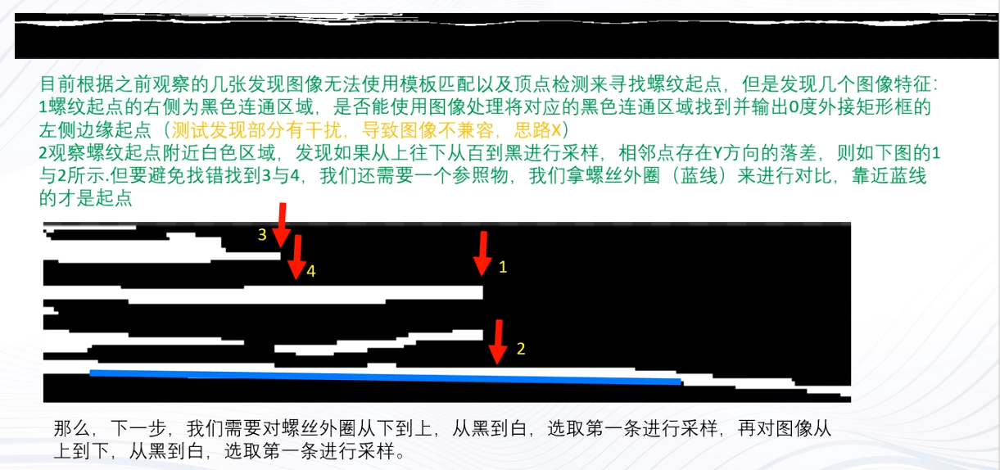
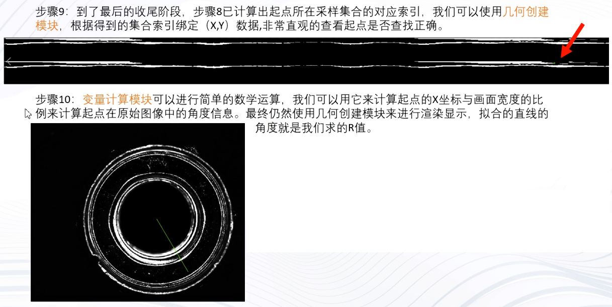
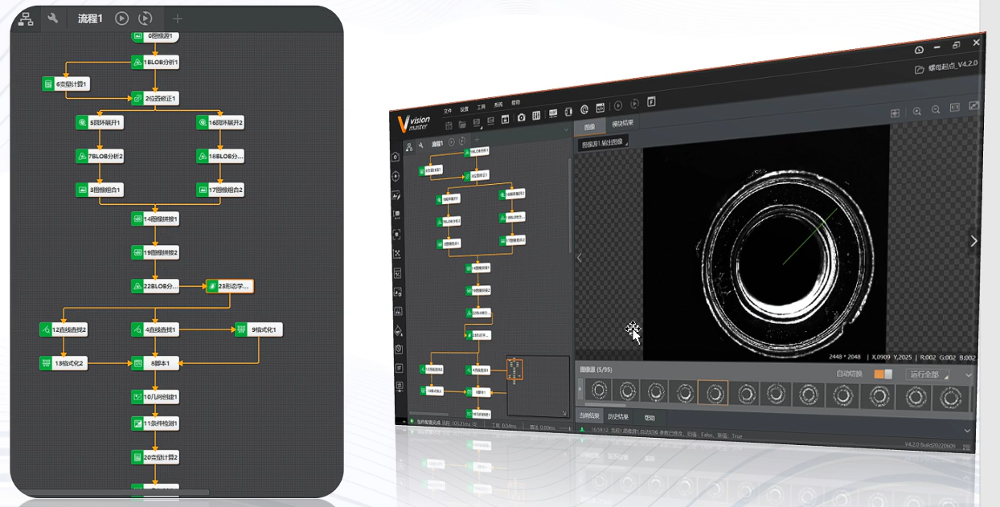

# 单相机螺纹测量应用案例

import VideoPlayer from '@site/videoPlayer.js'

<VideoPlayer src="https://xian-vforum.oss-cn-hangzhou.aliyuncs.com/2022-07-19_jcrHqiXjKI_%E5%8D%95%E7%9B%B8%E6%9C%BA%E8%9E%BA%E7%BA%B9%E6%B5%8B%E9%87%8F%E5%BA%94%E7%94%A8%E6%A1%88%E4%BE%8B.mp4"/>

## 前言

## 1. 场景介绍

## 2. 硬件选型

## 3. 物料成像剖析,制定方案

## 4. VM方案逐步搭建(遇到的问题和解决方案)

## 5. 成品展示

## 6. 项目知识点回顾总结

